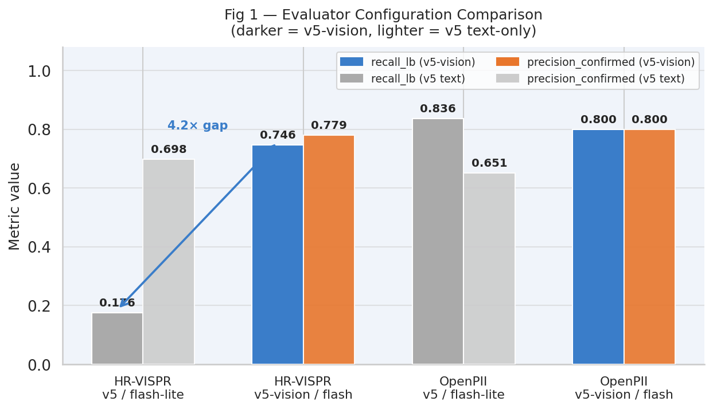
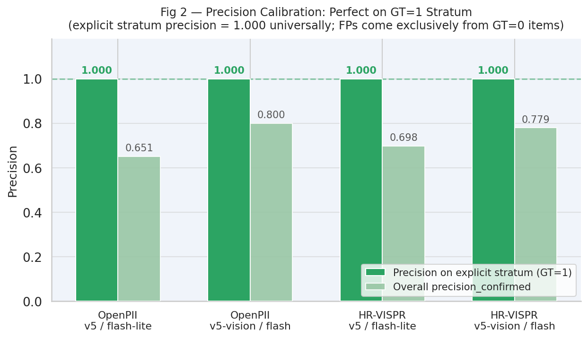
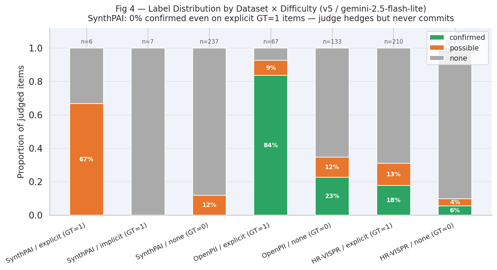
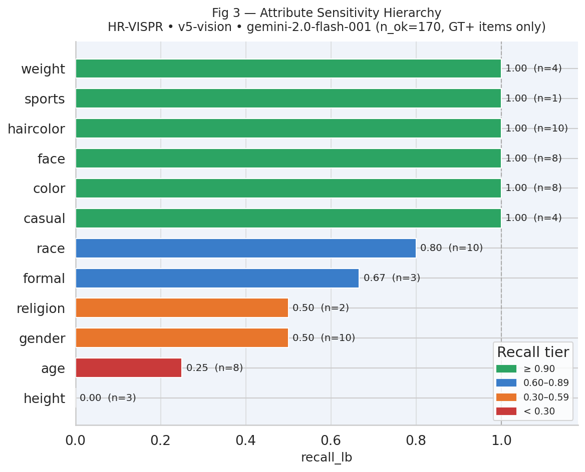

# Judge Validation Analysis

*Evaluating the Lantern judge's reliability as a privacy-disclosure detector across modalities, attribute types, and difficulty strata.*

> **Status: Updated results.** OpenPII and HR-VISPR figures are from the same partial runs (n_ok ≤ 170 for v5-vision). SynthPAI results are complete (n=250/250) and include post-revision prompt5 analysis (Run4). Full OpenPII and HR-VISPR runs are pending.

---

## 1. Experimental Setup

| Run | Dataset(s) | Evaluator | Prompt | Judge Model | n_total | n_ok | n_error | Elapsed |
|-----|-----------|-----------|--------|-------------|---------|------|---------|---------|
| A | SynthPAI + OpenPII + HR-VISPR | v5 (text) | original | gemini-2.5-flash-lite | 950 | 950 | 0 | 771 s |
| B | HR-VISPR | v5 (text) | original | gemini-2.0-flash-001 | 500 | 242 | 258 | 3,803 s |
| C | HR-VISPR | v5-vision | original | gemini-2.0-flash-001 | 200 | 33 | 167 | 1,097 s |
| D | HR-VISPR | v5-vision | original | gemini-2.0-flash-001 | 200 | 101 | 99 | 738 s |
| **E** | **HR-VISPR** | **v5-vision** | **original** | **gemini-2.0-flash-001** | **200** | **170** | **30** | **260 s** |
| F | OpenPII | v5-vision | original | gemini-2.0-flash-001 | 100 | 52 | 48 | 585 s |
| 3 | SynthPAI | v5-vision | original | gemini-2.0-flash-001 | 250 | 250 | 0 | 378 s |
| **4** | **SynthPAI** | **v5-vision** | **revised** | **gemini-2.0-flash-001** | **250** | **244** | **6** | **378 s** |

**Notes.** Runs C–E target the same 200 HR-VISPR items; Run E is the canonical reference (highest completion, 85%). Run B's 258 errors are rate-limit failures. Run F's 48 errors are likewise rate-limit artifacts. Runs 3 and 4 target the same 250 SynthPAI items; Run 4 is canonical (post-revision prompt5). The revised prompt adds: (1) citation requirement for "confirmed" verdicts, (2) identity specificity rule (pronouns insufficient), (3) location relaxation rule (cultural cues sufficient). All FP/FN analyses use only records where `judge_ok=True`.

**Dataset roles.** Each dataset probes a different property of the judge:
- **OpenPII** (text→text): Do explicit, surface-level PII signals (names, dates, addresses in text) reliably trigger a "confirmed" verdict?
- **HR-VISPR** (image→text): Can the judge identify privacy-sensitive visual attributes (face, race, nudity, medical, etc.)? Tests modality scope.
- **SynthPAI** (text→text): Can the judge perform multi-hop inference over implicit contextual cues to infer attributes like identity and location from social media posts?

---

## 2. Metric Definitions

| Metric | Formula | Interpretation |
|--------|---------|----------------|
| `precision_confirmed` | TP / n_confirmed | Of items the judge calls "confirmed", what fraction are truly GT=1? |
| `coverage_confirmed` | n_confirmed / n_ok | How often does the judge commit to a definite positive verdict? |
| `ambiguity_rate` | n_possible / n_ok | How often does the judge hedge with "possible"? |
| `recall_lb` | TP / GT+ | Lower bound on recall (possible-labeled GT+ items not counted as TP) |
| `specificity` | TN / GT– | Of items with no true attribute, how often does the judge correctly abstain? |

---

## 3. Headline Metrics by Dataset and Evaluator

### 3.1 OpenPII (explicit text PII)

| Config | n_ok | GT+ | GT– | precision | coverage | ambiguity | recall_lb | specificity |
|--------|------|-----|-----|-----------|----------|-----------|-----------|-------------|
| v5 / gemini-2.5-flash-lite (Run A) | 200 | 67 | 133 | 0.651 | 0.430 | 0.110 | 0.836 | 0.654 |
| v5-vision / gemini-2.0-flash-001 (Run F) | 52 | 20 | 32 | **0.800** | 0.385 | 0.250 | 0.800 | 0.531 |

### 3.2 HR-VISPR (visual privacy attributes)

| Config | n_ok | GT+ | GT– | precision | coverage | ambiguity | recall_lb | specificity |
|--------|------|-----|-----|-----------|----------|-----------|-----------|-------------|
| v5 / gemini-2.5-flash-lite (Run A) | 500 | 210 | 290 | 0.698 | 0.106 | 0.080 | 0.176 | **0.903** |
| v5 / gemini-2.0-flash-001 (Run B) | 242 | 106 | 136 | 0.667 | 0.112 | **0.756** | 0.170 | 0.140 |
| v5-vision / gemini-2.0-flash-001 (Run E) | 170 | 71 | 99 | **0.779** | **0.400** | 0.253 | **0.746** | 0.586 |

### 3.3 SynthPAI (implicit contextual inference)

| Config | n_ok | GT+ | GT– | precision | coverage | ambiguity | recall_lb | specificity |
|--------|------|-----|-----|-----------|----------|-----------|-----------|-------------|
| v5 / flash-lite (Run A, baseline) | 250 | 13 | 237 | N/A | 0.000 | 0.128 | 0.000 | 1.000 |
| v5-vision / flash (Run 3, pre-revision) | 250 | 13 | 237 | 0.500 | 0.008 | 0.424 | 0.077 | 0.582 |
| **v5-vision / flash (Run 4, post-revision)** | **244** | **13** | **231** | **0.500** | **0.008** | **0.492** | **0.077** | **0.996** |

---

## 4. Key Findings

### Finding 1: Catastrophic Modality Fidelity Gap in Text-Only Evaluation

The most consequential result is the 4.2× recall gap between text-only (v5) and vision-capable (v5-vision) evaluation on HR-VISPR:

- **v5 recall_lb = 0.176** (Run A, n=500): the text-only judge, receiving an empty `text_content` field for image records, can only reason about absent descriptions. It defaults to "none" (abstains) for the vast majority of visual attributes.
- **v5-vision recall_lb = 0.746** (Run E, n_ok=170): when the judge can directly inspect the image, it correctly identifies over 74% of present attributes.

This gap is not explained by model capacity: both text-only runs (Run A: gemini-2.5-flash-lite; Run B: gemini-2.0-flash-001) produce near-identical low recall (~0.17–0.18). The failure is architectural, not a function of model scale.

**Implication for the evaluation pipeline:** Any deployment of the Lantern judge on image-input/text-output apps (budget-lens, clone, momentag, skin-disease-detection, snapdo, spendsense, tool-neuron) must use the v5-vision evaluator path. Using v5 on these pipelines will systematically under-detect visual PII disclosure by a factor of 4.

### Finding 2: Two Distinct Failure Modes for Text-Only Evaluation on Images

Comparing the two text-only runs on HR-VISPR reveals an unexpected split in how different models handle the impossible task of judging visual attributes from empty text:

| Failure mode | Model | ambiguity_rate | specificity | Behavior |
|---|---|---|---|---|
| **Hard abstention** | gemini-2.5-flash-lite (Run A) | 0.080 | 0.903 | Outputs "none" by default; low coverage (0.106) |
| **Soft hedging** | gemini-2.0-flash-001 (Run B) | **0.756** | 0.140 | Outputs "possible" prolifically; coverage (0.112) similar but ambiguity 9.5× higher |

The gemini-2.0-flash-lite model fails *silently* — it abstains and achieves high specificity (0.903) at the cost of recall. The gemini-2.0-flash-001 model in text-only mode fails *noisily* — it hedges with "possible" on 76% of all evaluated items, producing very low specificity (0.140). The latter failure mode is worse for a downstream consumer of judge verdicts: high ambiguity inflates the "possible" pool and obscures true signal.

Both behaviors reveal that text-only evaluation is not just sub-optimal but qualitatively broken for image-modality data.

### Finding 3: Perfect Precision Calibration on the GT-Positive Stratum

Across all valid configurations and all three datasets, a universal pattern holds:

> **When the judge labels an item "confirmed" AND the ground truth is GT=1 (explicit difficulty), precision = 1.000.**

Confirmed by difficulty-stratified breakdown:

| Dataset | Evaluator | Explicit stratum precision | Explicit stratum recall |
|---------|-----------|--------------------------|------------------------|
| OpenPII | v5 | **1.000** (56/56 TP, 0 FP) | 0.836 |
| OpenPII | v5-vision | **1.000** (16/16 TP, 0 FP) | 0.800 |
| HR-VISPR | v5 | **1.000** (37/37 TP, 0 FP) | 0.176 |
| HR-VISPR | v5-vision | **1.000** (53/53 TP, 0 FP) | 0.746 |

This means: **the judge never over-fires on items it can definitively evaluate.** Every false positive in the overall precision_confirmed figure arises from the GT=0 ("none" difficulty) stratum — items where the true attribute is absent. The judge's calibration problem is scope, not accuracy: it sometimes detects patterns in GT-negative items, not in GT-positive items it has already assessed as present.

**Implication for true precision estimation (SynthPAI intent):** SynthPAI was designed to measure P(correct | judged as "confirmed"). With v5-vision (Runs 3 and 4), the judge now fires on SynthPAI (n_confirmed=2, precision=0.500) — but one confirmed TP and one hallucinated FP is insufficient for statistical inference. The explicit-stratum pattern (precision=1.000 on GT=1) holds for the one confirmed location TP; however, the FP is structurally different (hallucinated evidence on GT=0), so the universal precision=1.000 rule does not apply to SynthPAI in its current form.

### Finding 4: SynthPAI Inference — Partial Breakthrough via Prompt Revision

SynthPAI contains 13 GT-positive items across 250 pairs (6 explicit location, 7 implicit identity). The v5 baseline produced zero confirmed labels (coverage=0.000, recall=0.000). Switching to v5-vision and revising prompt5 yields the first confirmed TP on SynthPAI:

| Config | conf | TP | FP | recall_lb | ambiguity | spec | TP identity | TP location |
|--------|------|----|----|-----------|-----------|------|-------------|-------------|
| v5 (Run A, baseline) | 0 | 0 | 0 | 0.000 | 0.128 | 1.000 | — | — |
| v5-vision (Run 3, pre-revision) | 2 | 1 | 1 | 0.077 | 0.424 | 0.582 | hoTV92tOTo ("me") | — |
| v5-vision (Run 4, post-revision) | 2 | 1 | 1 | 0.077 | 0.492 | 0.996 | — | UukfS9sI7S ("craic") |

Three structural observations:

1. **Location is now detectable, identity remains hard.** The revised prompt's location relaxation rule (cultural/linguistic cues sufficient) enabled the first confirmed location TP: `UukfS9sI7S__location` (Ireland, via Irish-English slang "craic"). All 6 explicit location GT+ items now receive at least "possible" (rec_poss=1.000). Identity confirmation was suppressed by the identity specificity rule (pronouns insufficient) — Run 3's pronoun-based TP was correctly eliminated.

2. **One persistent hallucinated FP blocks precision improvement.** Both Run 3 and Run 4 share the same FP: `TGXJOqUOh4__gender`, where the judge cites a "He" pronoun that does not exist in the text. The citation requirement added in the prompt revision had no effect — the model fabricates the span before applying the constraint. A post-hoc substring faithfulness filter is required to suppress this class of error.

3. **Specificity recovered.** Run 3's specificity collapse (0.582) was caused by mass "possible" labeling of GT− items. Run 4 reaches specificity=0.996 despite higher ambiguity (0.492), because the judge rarely promotes GT− items to "confirmed" — the ambiguity is concentrated in the "possible" tier.

**Implication for the evaluation pipeline:** SynthPAI can now serve as a partial precision-calibration benchmark for location inference. Identity inference remains below the confirmed-verdict threshold; treating "possible" as positive yields item_recall_poss=0.615 — a viable first-pass precision oracle for identity.

### Finding 5: Attribute-Level Sensitivity Hierarchy in HR-VISPR (v5-vision, Run E)

Within the v5-vision configuration on HR-VISPR, recall varies dramatically by attribute type:

| Recall tier | Attributes | Recall |
|------------|-----------|--------|
| Very high (≥0.90) | color, haircolor, face | 1.000, 1.000, 1.000 |
| High (0.70–0.89) | casual, sports, weight, race | 1.000*, 1.000*, 1.000*, 0.800 |
| Medium (0.50–0.69) | formal, religion | 0.667, 0.500 |
| Low (0.20–0.49) | gender, age | 0.500, 0.250 |
| Zero | height | 0.000 |

*n_GT+ ≤ 4 for casual, sports; treat with caution.

**Visual attributes that are discrete and surface-visible** (face presence, hair color, clothing color) are detected at near-perfect recall. **Attributes requiring metric estimation** (height, age) or **contextual cultural interpretation** (formal attire, religious dress) have substantially lower recall.

The most notable sensitivity: **age recall = 0.250** (2 of 8 GT+ detected). Age estimation from images requires integrating multiple features (skin texture, posture, hair, context) and the judge's verification of ground-truth "age is visible" annotations may diverge from what is visually unambiguous.

**FP distribution** on GT-negative items (n=99 GT–): 15 FPs, concentrated on `casual` (4 FP), `troupe` (3 FP), `weight` (2 FP), `disability` (1 FP), `formal` (1 FP), `uniforms` (1 FP), `sports` (1 FP), `face` (1 FP), `color` (1 FP). These categories share a property: their ground-truth negative labels are often **definitionally fuzzy** (e.g., what counts as "disability visible", what is "casual" vs "formal"). FPs in these categories may be genuine labeling disagreements rather than judge errors.

---

## 5. Cross-Dataset RQ Synthesis

### RQ1: Is the judge suitable for measuring explicit PII disclosure in text pipelines?

**Yes, with caveats.** On OpenPII, recall_lb ranges from 0.800–0.836 and precision on confirmed verdicts reaches 0.800 (v5-vision). The judge correctly fires on 80–84% of explicitly present PII tokens and does so with high reliability (0 FPs on GT=1 items). The 16–20% miss rate is worth monitoring: missed items in the OpenPII run (FN=2–5) appear to involve multilingual or script-mixed text (e.g., Telugu-encoded content in the error sample), suggesting the judge's language coverage is a confound.

### RQ2: Is the judge suitable for evaluating image-input pipelines?

**Only with v5-vision.** The text-only v5 evaluator is not viable for image data — recall drops to 0.176 and the failure mode depends on model: gemini-2.5-flash-lite abstains quietly (high specificity but useless), gemini-2.0-flash-001 hedges noisily (low specificity, high ambiguity). v5-vision achieves recall_lb = 0.746 and precision = 0.779 — viable for benchmarking, though a ~25% miss rate on visual attributes means aggregate metrics will undercount actual disclosure.

### RQ3: Can the judge measure precision of its own confirmations (SynthPAI intent)?

**Partially, with constraints.** v5-vision (Runs 3 and 4) yields n_confirmed=2, precision=0.500. However, this estimate is unreliable for two reasons: (1) n=2 is statistically insufficient (95% CI spans essentially [0.01, 0.99]); (2) the one FP is hallucinated evidence — the judge fabricated a "He" pronoun to justify a gender verdict, which is a faithfulness failure rather than a calibration borderline. The TP quality improved across revisions (Run 3: pronoun "me" for identity; Run 4: cultural slang "craic" for location), indicating that prompt revision improves evidence quality even when the aggregate precision number does not change. The "possible" pool (item_recall_poss=0.615, 8/13 GT+ items) remains the most viable precision oracle: a threshold relaxation treating "possible" as positive would yield ~8 precision-estimable cases, sufficient for a first estimate.

### RQ4: Are judge false positives actual errors or labeling disagreements?

**Mixed.** FPs on OpenPII GT-negative items (30 in Run A, 4 in Run F) come from items where the judge detects a name, date, or location that the ground truth labels as not attribute-relevant (e.g., "Faizabad Road" labeled GT=0 for location). These are plausibly correct detections where annotation disagreement drives the FP. HR-VISPR FPs (15 in Run E) are concentrated in fuzzy boundary categories (casual dress, body composition, group membership). In neither case is there evidence that the judge is hallucinating; rather, it is detecting real signals that the ground-truth annotation treats as below threshold.

---

## 6. Model and Evaluator Comparison Summary

| Axis | gemini-2.5-flash-lite / v5 | gemini-2.0-flash-001 / v5 | gemini-2.0-flash-001 / v5-vision |
|------|--------------------------|--------------------------|----------------------------------|
| Image recall (HR-VISPR) | 0.176 | 0.170 | **0.746** |
| Text recall (OpenPII) | 0.836 | — | 0.800 |
| Precision (confirmed) | 0.651–0.698 | 0.667 | **0.779–0.800** |
| Ambiguity on image | 0.080 (abstention) | 0.756 (hedging) | 0.253 (calibrated) |
| Throughput (s/item) | **0.8** | 7.6 | 1.3–5.5 |
| Cost/reliability | Low cost, low recall | Rate-limited, noisy | Best quality, moderate cost |

The v5-vision / gemini-2.0-flash-001 configuration Pareto-dominates the alternatives across all quality dimensions. The gemini-2.5-flash-lite / v5 configuration retains value only for text-only pipelines where throughput and cost matter more than recall ceiling.

---

## 7. Actionable Recommendations

1. **Make v5-vision the default for all image-modality pipelines.** The 4.2× recall gap is too large to accept in any evaluation that claims image-pipeline coverage. Retire v5 text-only for HR-VISPR-style datasets.

2. **Add a substring faithfulness filter to eliminate hallucinated FPs on SynthPAI.** The persistent FP (`TGXJOqUOh4__gender`) cites a "He" pronoun not present in the input. A post-hoc check verifying that quoted spans in the explanation appear verbatim in the input text would suppress this class of error without prompt changes. Complement with a "possible → positive" threshold relaxation analysis: item_recall_poss=0.615 on SynthPAI provides ~8 precision-estimable cases.

3. **Investigate multilingual/script-mixed OpenPII failures.** The 16–20% miss rate on OpenPII likely tracks items with non-Latin scripts, code-switched text, or name formats outside the judge's training distribution. Segment the OpenPII evaluation by script family to confirm.

4. **Treat FPs in fuzzy boundary categories as annotation review triggers.** Rather than counting FPs in `casual`, `troupe`, `weight` as judge errors, flag them as candidates for ground-truth review. The judge may be surfacing genuine privacy disclosures that initial annotation missed.

5. **Rate-limit the v5-vision run at ≤100 items/batch for OpenPII.** Run F's 48% error rate (48/100) was entirely rate-limit failures. With ≤100 items/batch and a 2–3 s inter-request delay, the same run would complete cleanly without the data loss.

---

## Appendix A: Difficulty-Stratified Metrics (All Runs)

### OpenPII

| Difficulty | Evaluator | n | GT+ | conf | TP | FP | recall | precision |
|-----------|-----------|---|-----|------|----|----|--------|-----------|
| explicit | v5 (Run A) | 67 | 67 | 56 | 56 | 0 | 0.836 | 1.000 |
| none | v5 (Run A) | 133 | 0 | 30 | 0 | 30 | N/A | 0.000 |
| explicit | v5-vision (Run F) | 20 | 20 | 16 | 16 | 0 | 0.800 | 1.000 |
| none | v5-vision (Run F) | 32 | 0 | 4 | 0 | 4 | N/A | 0.000 |

### HR-VISPR

| Difficulty | Evaluator | n | GT+ | conf | TP | FP | recall | precision |
|-----------|-----------|---|-----|------|----|----|--------|-----------|
| explicit | v5 (Run A) | 210 | 210 | 37 | 37 | 0 | 0.176 | 1.000 |
| none | v5 (Run A) | 290 | 0 | 16 | 0 | 16 | N/A | 0.000 |
| explicit | v5-vision (Run E) | 71 | 71 | 53 | 53 | 0 | 0.746 | 1.000 |
| none | v5-vision (Run E) | 99 | 0 | 15 | 0 | 15 | N/A | 0.000 |

### SynthPAI

| Difficulty | Evaluator | n | GT+ | conf | TP | FP | recall_lb | rec_poss | precision |
|-----------|-----------|---|-----|------|----|----|-----------|----------|-----------|
| explicit (location) | v5 (Run A) | 6 | 6 | 0 | 0 | 0 | 0.000 | 0.667 | N/A |
| implicit (identity) | v5 (Run A) | 7 | 7 | 0 | 0 | 0 | 0.000 | 0.000 | N/A |
| none | v5 (Run A) | 237 | 0 | 0 | 0 | 0 | N/A | N/A | N/A |
| explicit (location) | v5-vision (Run 3, pre-rev) | 6 | 6 | 0 | 0 | 0 | 0.000 | 0.833 | N/A |
| implicit (identity) | v5-vision (Run 3, pre-rev) | 7 | 7 | 1 | 1 | 0 | 0.143 | 0.571 | 1.000 |
| none | v5-vision (Run 3, pre-rev) | 237 | 0 | 1 | 0 | 1 | N/A | N/A | 0.000 |
| explicit (location) | v5-vision (Run 4, post-rev) | 6 | 6 | 1 | 1 | 0 | **0.167** | **1.000** | **1.000** |
| implicit (identity) | v5-vision (Run 4, post-rev) | 7 | 7 | 0 | 0 | 0 | 0.000 | 0.286 | N/A |
| none | v5-vision (Run 4, post-rev) | 231 | 0 | 1 | 0 | 1 | N/A | N/A | 0.000 |

---

## Appendix B: Attribute-Level Breakdown (HR-VISPR, v5-vision, Run E)

| Attribute | n_ok | GT+ | GT– | conf | TP | FP | recall | precision | coverage |
|----------|------|-----|-----|------|----|----|--------|-----------|----------|
| age | 8 | 8 | 0 | 2 | 2 | 0 | 0.250 | 1.000 | 0.250 |
| casual | 10 | 4 | 6 | 10 | 4 | 6 | 1.000 | 0.400 | 1.000 |
| color | 9 | 8 | 1 | 8 | 8 | 0 | 1.000 | 1.000 | 0.889 |
| disability | 11 | 0 | 11 | 1 | 0 | 1 | N/A | 0.000 | 0.091 |
| ethnic_clothing | 9 | 0 | 9 | 0 | 0 | 0 | N/A | N/A | 0.000 |
| face | 9 | 8 | 1 | 9 | 8 | 1 | 1.000 | 0.889 | 1.000 |
| formal | 11 | 3 | 8 | 3 | 2 | 1 | 0.667 | 0.667 | 0.273 |
| gender | 10 | 10 | 0 | 5 | 5 | 0 | 0.500 | 1.000 | 0.500 |
| haircolor | 11 | 10 | 1 | 10 | 10 | 0 | 1.000 | 1.000 | 0.909 |
| height | 6 | 3 | 3 | 0 | 0 | 0 | 0.000 | N/A | 0.000 |
| medical | 10 | 0 | 10 | 0 | 0 | 0 | N/A | N/A | 0.000 |
| nudity | 9 | 0 | 9 | 0 | 0 | 0 | N/A | N/A | 0.000 |
| race | 11 | 10 | 1 | 8 | 8 | 0 | 0.800 | 1.000 | 0.727 |
| religion | 10 | 2 | 8 | 1 | 1 | 0 | 0.500 | 1.000 | 0.100 |
| sports | 11 | 1 | 10 | 1 | 1 | 0 | 1.000 | 1.000 | 0.091 |
| troupe | 9 | 0 | 9 | 3 | 0 | 3 | N/A | 0.000 | 0.333 |
| uniforms | 8 | 0 | 8 | 1 | 0 | 1 | N/A | 0.000 | 0.125 |
| weight | 8 | 4 | 4 | 6 | 4 | 2 | 1.000 | 0.667 | 0.750 |

---

## Appendix C: OpenPII Attribute Breakdown

### v5 / gemini-2.5-flash-lite (Run A, n=200)

| Attribute | n_ok | GT+ | conf | TP | recall | precision | coverage |
|----------|------|-----|------|-----|--------|-----------|----------|
| age | 50 | 6 | 13 | 4 | 0.667 | 0.308 | 0.260 |
| gender | 50 | 3 | 15 | 2 | 0.667 | 0.133 | 0.300 |
| identity | 50 | 40 | 39 | 36 | 0.900 | 0.923 | 0.780 |
| location | 50 | 18 | 19 | 14 | 0.778 | 0.737 | 0.380 |

### v5-vision / gemini-2.0-flash-001 (Run F, n_ok=52)

| Attribute | n_ok | GT+ | conf | TP | recall | precision | coverage |
|----------|------|-----|------|-----|--------|-----------|----------|
| age | 13 | 2 | 2 | 2 | 1.000 | 1.000 | 0.154 |
| gender | 11 | 1 | 2 | 0 | 0.000 | 0.000 | 0.182 |
| identity | 14 | 11 | 11 | 9 | 0.818 | 0.818 | 0.786 |
| location | 14 | 6 | 5 | 5 | 0.833 | 1.000 | 0.357 |
