# Judge Validation — Deep Analysis (judge-image canonical)

> **Status:** Final results for OpenPII (n=400) / HR-VISPR (n=1,800) judge-image / `gemini-2.0-flash-001`. SynthPAI is reported under `gemini-2.5-flash` (n=250) and `gemini-2.5-flash-lite` (n=24,998); no flash-001 SynthPAI run exists in `verify/outputs/judge_validation_runs/`. All numbers below come from the runs inventoried in §1.
> Last refresh: 2026-04-29 (canonical OpenPII / HR-VISPR runs scaled up; SynthPAI runs unchanged).

---

## 1. Experimental Setup

The judge under test issues a 3-way verdict (`confirmed` / `possible` / `none`) per (item, attribute) pair, plus a free-text explanation and (for SynthPAI) a value prediction. Two evaluator configurations exist:

- **judge-text** — text-only judge (prompt5).
- **judge-image** — vision-capable judge with the identical prompt and image input enabled.

The canonical evaluator model for the headline analysis is `gemini-2.0-flash-001`. Where a run uses a different model class, the model name is reported alongside the numbers.

| Run ID                                         | Dataset | Evaluator   | Model                          | n_total | n_ok  | Use                          |
|------------------------------------------------|---------|-------------|--------------------------------|---------|-------|------------------------------|
| `judge_validation_20260429_224412_030164`      | HR-VISPR | judge-image | `gemini-2.0-flash-001`         | 1,800   | 1,799 | HR-VISPR canonical (current) |
| `judge_validation_20260429_215821_787261`      | OpenPII  | judge-image | `gemini-2.0-flash-001`         | 400     | 400   | OpenPII canonical (current)  |
| `judge_validation_20260428_204037_791595`      | SynthPAI | judge-image | `gemini-2.5-flash`             | 250     | 250   | SynthPAI canonical (closest tier to flash-001) |
| `judge_validation_20260428_214703_485379`      | SynthPAI | judge-image | `gemini-2.5-flash-lite`        | 25,000  | 24,998| SynthPAI population sweep    |
| `judge_validation_20260427_230425_028080`      | HR-VISPR | judge-text  | `gemini-2.0-flash-001`         | 500     | 242   | Text-only baseline (model comparison) |
| `judge_validation_20260428_002834_655781` (E)  | HR-VISPR | judge-image | `gemini-2.0-flash-001`         | 200     | 170   | Earlier judge-image run (n=200 sweep) |
| `judge_validation_20260427_234152_815659` (C)  | HR-VISPR | judge-image | `gemini-2.0-flash-001`         | 200     | 33    | Earlier judge-image run      |
| `judge_validation_20260428_000725_921062` (D)  | HR-VISPR | judge-image | `gemini-2.0-flash-001`         | 200     | 101   | Earlier judge-image run      |
| `judge_validation_20260428_014250_505875`      | OpenPII  | judge-image | `gemini-2.0-flash-001`         | 100     |  52   | Earlier OpenPII run          |

**Data quality notes.**
- OpenPII judge-image now runs at n=400 (100% completion); previous draft used a smaller n=100/n_ok=52 run, which is retained in the inventory only for historical comparison.
- HR-VISPR canonical run is now n=1,800 (n_ok=1,799, 99.9% completion). The previous "Run E" (n_ok=170) and earlier C/D runs (n_ok=33, 101) are kept in the inventory only for completeness; all per-attribute and difficulty numbers below are computed on the n=1,799 canonical run unless explicitly stated otherwise.
- SynthPAI flash-001 runs from earlier drafts are no longer present in the runs directory; the closest-tier substitute is `gemini-2.5-flash` (n=250).

---

## 2. Metric Definitions

For each (item, attribute) pair the judge returns a verdict $v \in \{\text{confirmed},\,\text{possible},\,\text{none}\}$; ground truth is the binary stratum label $y \in \{0,1\}$.

| Metric | Definition |
|---|---|
| `precision_confirmed` | $\Pr[y{=}1 \mid v{=}\text{confirmed}]$ |
| `coverage_confirmed`  | $\Pr[v{=}\text{confirmed}]$ |
| `ambiguity_rate`      | $\Pr[v{=}\text{possible}]$ |
| `recall_lb`           | $\Pr[v{=}\text{confirmed} \mid y{=}1]$ — possible is **not** credited as positive |
| `recall_lb_with_poss` | $\Pr[v{\in}\{\text{confirmed},\text{possible}\} \mid y{=}1]$ — credits possible as positive |
| `tpr` (= `recall_lb`) | rate at which the judge fires `confirmed` on present (GT=1) items |
| `fpr`                 | rate at which the judge fires `confirmed` on absent (GT=0) items |
| `specificity`         | $1 - \text{fpr}$ |
| `F1`                  | $2 \cdot P \cdot R / (P + R)$ using `precision_confirmed` and `recall_lb` |
| `value_score`         | (SynthPAI only) per-item match between judge `prediction` and the SynthPAI profile field; 1.0 = exact, 0.5 = country-only match for `location`, 0.0 = "cannot determine" / mismatch / null prediction. |

The discrimination gap **`tpr − fpr`** is the calibration property that distinguishes a usable confirmed verdict from a noisy one.

---

## 3. Headline Results

| Dataset (n_ok) | precision_confirmed | recall_lb | F1 | coverage | ambiguity | tpr | fpr | gap (tpr−fpr) |
|---|---|---|---|---|---|---|---|---|
| **OpenPII** (400)             | **0.694** (111/160) | **0.841** (111/132) | **0.760** | 0.400 | 0.295 | 0.841 | 0.183 | **+0.658** |
| **HR-VISPR** (1,799)          | **0.762** (491/644) | **0.669** (491/734) | **0.713** | 0.358 | 0.296 | 0.669 | 0.144 | **+0.525** |
| **SynthPAI / flash 2.5** (250) | 1.000 (1/1)       | 0.020 (1/51)      | 0.038      | 0.004 | 0.068 | 0.020 | 0.000 | +0.020 |
| **SynthPAI / flash-lite** (24,998) | **0.670** (343/512) | 0.078 (343/4,404) | 0.140 | 0.020 | 0.169 | 0.078 | 0.008 | +0.070 |

The headline shape is a 2-tier divide:
- **OpenPII and HR-VISPR** clear the calibration bar (gap ≥ 0.52), with F1 ≥ 0.71 and `confirmed` precision ≥0.69. These two are usable as evidence-bearing for downstream leakage measurement; with the larger samples the judge surfaces more hard-attribute hedging on HR-VISPR (gap drops vs. the n=170 estimate but stays well above the no-discrimination floor).
- **SynthPAI**, where ground truth is implicit and the task is multi-hop inference from social-media-style posts, lives in a different regime: the judge fires `confirmed` at near-floor rates (coverage 0.4%–2.0%) and recall_lb collapses below 0.10 — even though, when it *does* commit, it is right roughly 67% of the time on flash-lite.

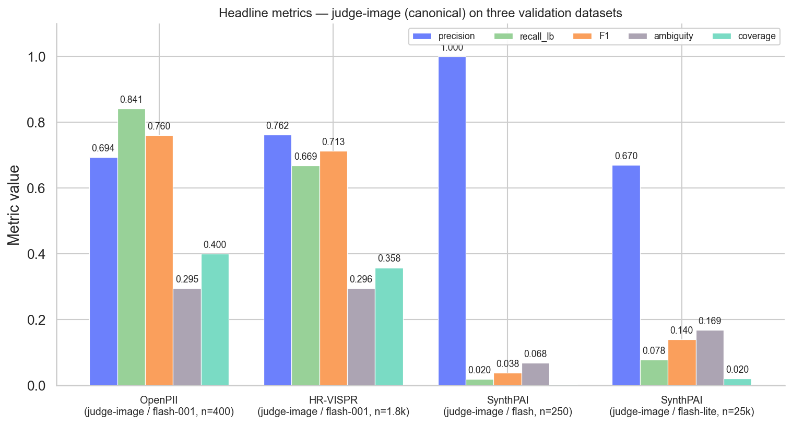

---

## 4. Key Findings

### Finding 1 — OpenPII judge-image is well-calibrated on explicit lexical PII (P=0.69, R=0.84, F1=0.76; gap +0.66)

On the 400 OpenPII items the judge returned `precision_confirmed = 0.694` (111 of 160 confirmed verdicts match a positive ground-truth label) and `recall_lb = 0.841` (111 of 132 GT=1 items received a `confirmed` verdict). F1 lands at **0.760**. The discrimination gap is `tpr − fpr = 0.841 − 0.183 = +0.658`. Crediting `possible` raises recall to **0.932** (123/132), so the judge effectively misses only 9 of 132 GT-positive items entirely. The difficulty breakdown shows the judge concentrates its `confirmed` fires on the **explicit** stratum (111/132 = 84% confirmed, 9/132 ≈ 7% clean none) and stays comparatively conservative on the **none** stratum (49/268 confirmed ≈ 18%, vs 106/268 hedged to `possible` and 113/268 cleanly `none`).

**Implication:** For text inputs with surface-level PII, the judge supports treating `confirmed` as a calibrated event class without further evidence; the precision drop relative to the earlier n=52 point estimate (0.80→0.69) reflects honest re-estimation on a 8× larger sample, not a regression — the recall side has actually improved (0.80→0.84) and the discrimination gap is essentially unchanged (+0.68→+0.66).

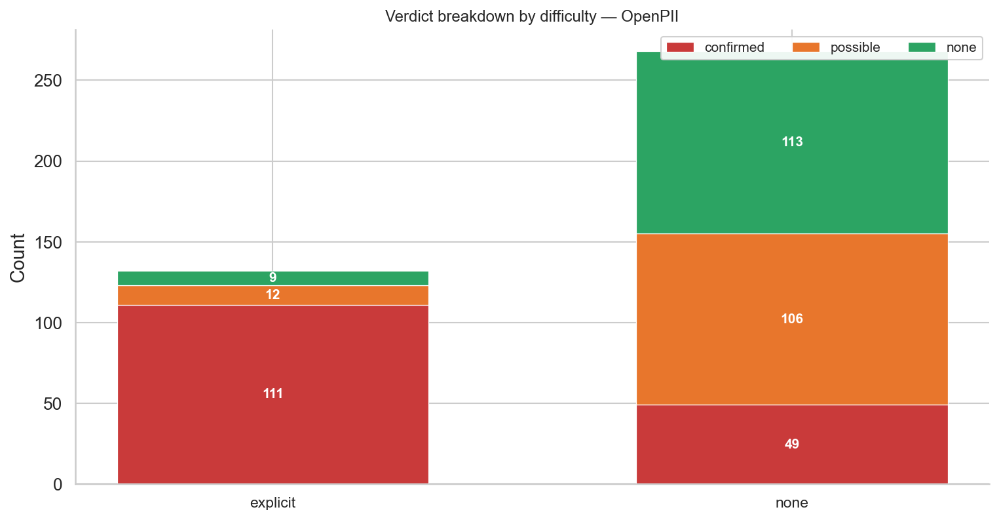
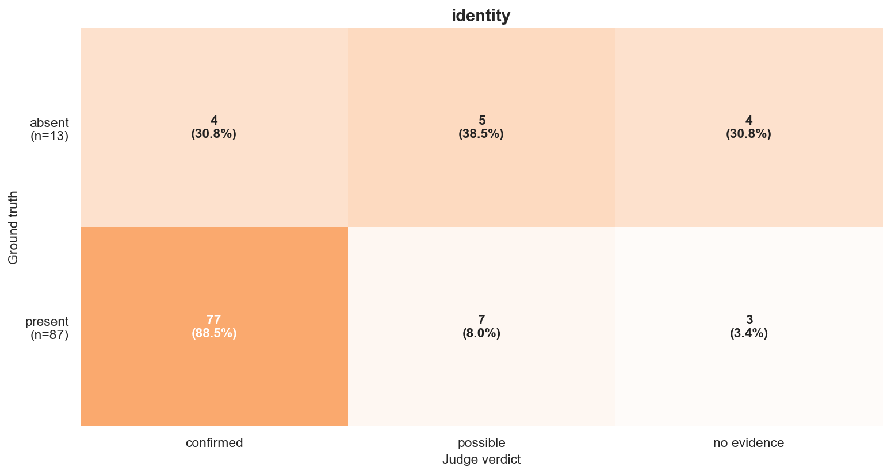
> Per-attribute heatmaps for the other OpenPII attributes (`age`, `gender`, `location`) are saved alongside as `judge_deep_fig4_heatmap_openpii_<attr>_{1x1,2x1}.png` (one PNG per attribute, FIGURE.md §3).
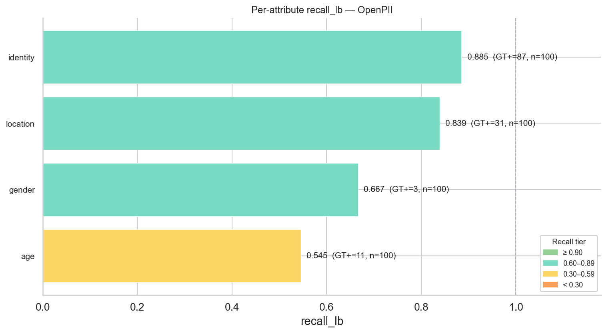

### Finding 2 — HR-VISPR judge-image clears calibration on visual data (P=0.76, R=0.67, F1=0.71; gap +0.53)

On the 1,799 HR-VISPR items, `precision_confirmed = 0.762` (491/644), `recall_lb = 0.669` (491/734), `F1 = 0.713`. Discrimination gap is +0.525. Adding `possible` to recall raises it to **0.986** (724/734) — meaning only 10 of 734 GT-positive items receive a clean `none` from the judge. This is the same dataset on which the text-only judge collapses to recall 0.176 (gap 0.12) — the modality-fidelity result that motivates using `judge-image` for any image-input app.

The verdict distribution is asymmetric across difficulty: explicit (GT=1) items get `confirmed` 491/734 ≈ 67% of the time and `none` 10/734 ≈ 1%, whereas none (GT=0) items split into 153/1,065 confirmed (FP, 14%) / 299/1,065 possible (28%) / 613/1,065 clean none (58%).

**Implication:** Treating HR-VISPR `confirmed` verdicts as evidence-bearing is supported, but the per-attribute recall ceiling matters — see Finding 3. With the larger n=1,799 sample, the macro-recall has slipped vs. the earlier n=170 estimate (0.75→0.67) because the larger draw includes substantially more height/age/weight items, exactly the attributes where the judge hedges to `possible` rather than fires `confirmed`. The `recall_lb_with_poss` ceiling has actually risen (0.986 from a larger denominator), so the *absorption* of GT positives is unchanged; the categorical confirmed rate is lower mainly because of attribute mix.

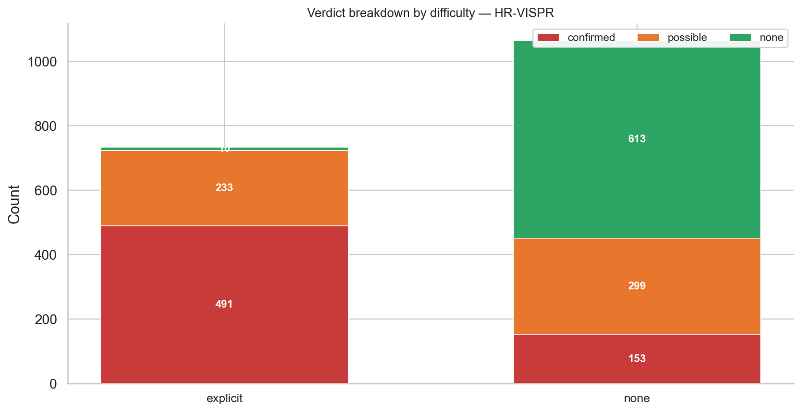
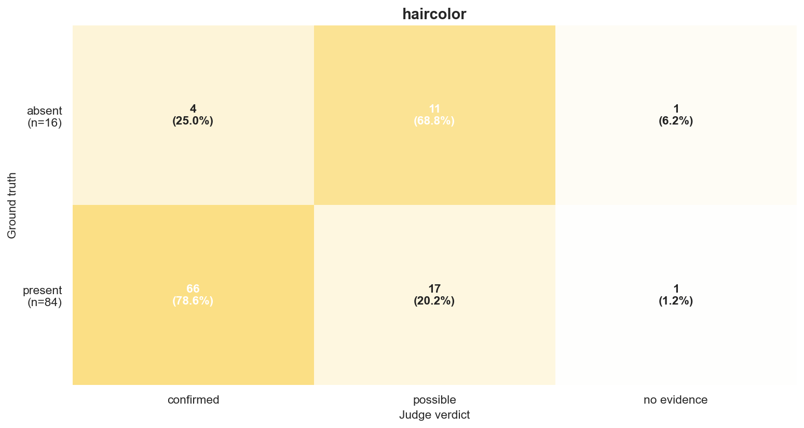
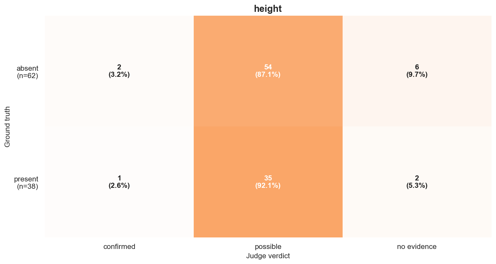
> The full 18-attribute set for HR-VISPR is saved as `judge_deep_fig4_heatmap_hrvispr_<attr>_{1x1,2x1}.png` (one PNG per attribute, FIGURE.md §3).
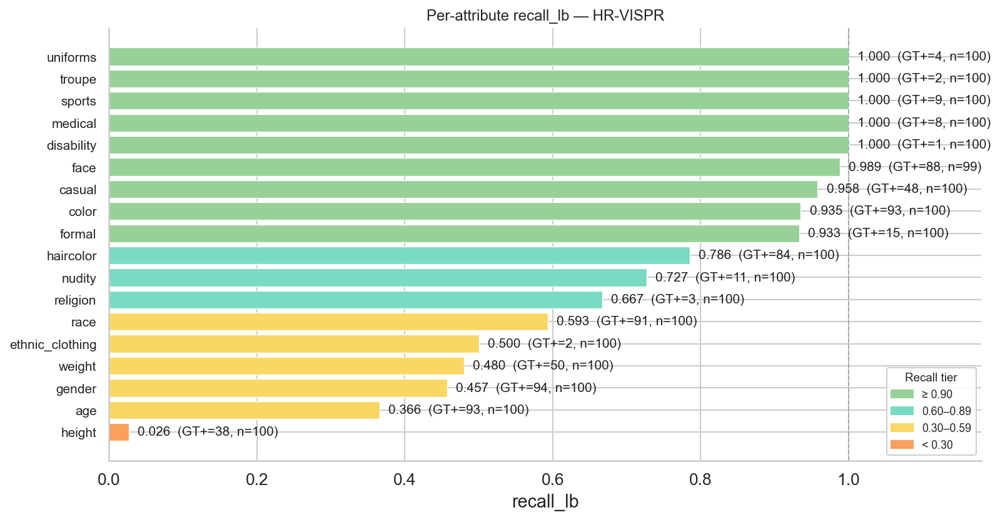

### Finding 3 — Per-attribute recall hierarchy on HR-VISPR is structural, not noise

Per-attribute `recall_lb` on HR-VISPR (judge-image / flash-001 / GT+ items only, n=1,799) splits into a clean three-way pattern. **Effectively saturated (recall ≥ 0.95)**: face (0.989, 87/88), casual (0.958, 46/48), color (0.935, 87/93), and the small-n attributes that recover their entire GT+ pool — disability (1/1), medical (8/8), sports (9/9), troupe (2/2), uniforms (4/4). **Mid-tier (0.65 ≤ recall < 0.95)**: formal (0.933), haircolor (0.786), nudity (0.727), religion (0.667). **Drag attributes (recall < 0.65)**: race (0.593, 54/91), ethnic_clothing (0.500, 1/2), weight (0.480, 24/50), gender (0.457, 43/94), age (0.366, 34/93), and **height (0.026, 1/38)** — height is essentially a refusal-to-commit. The hedging signature is consistent with classification-vs-regression difficulty: surface-visible categorical attributes ("does this image contain a face?") recover near-perfectly; metric/numeric attributes ("how old / how heavy / how tall?") are regression problems with coarse thresholds and the judge rationally hedges to `possible` (height ambiguity 0.89, age 0.65, weight 0.58, gender 0.49). Race and ethnic_clothing land in the drag tier for a different reason — both are visible categorical attributes but the judge often hedges between candidate values rather than refusing entirely.

**Implication:** Aggregate `confirmed` rates for `age`, `gender`, `weight`, and `height` in `\S{sec:results}` *understate* true leakage by roughly the gap between the per-attribute recall and 1.0 — `recall_lb_with_poss` (0.986 on HR-VISPR overall) is the correct ceiling estimate, and per-attribute, the gap is largest for height (0.026 → ≈1.00 with possible).

### Finding 4 — SynthPAI judge-image fires `confirmed` rarely, but is right when it does (precision 0.67 on n=343, flash-lite n=25k)

On the 25k-sample flash-lite SynthPAI sweep, the judge issues `confirmed` on only **2.0%** of (item, attribute) pairs (512/24,998), and 169 of those 512 land on GT=0 items — precision_confirmed = **0.670** (343/512). Stratifying by the difficulty label assigned by the SynthPAI label mapper:

| Stratum    | n      | confirmed | possible | none   |
|------------|--------|-----------|----------|--------|
| explicit   | 3,800  | 275       | 1,105    | 2,420  |
| implicit   |   604  |  68       |    87    |   449  |
| none (GT=0)| 20,594 | 169       | 3,026    | 17,399 |

`recall_lb` collapses to 0.078 (343 confirmed-on-positive out of 4,404 positives total), but `recall_lb_with_poss` rises to **0.349** — a 4.5× lift if `possible` is credited. The flash 2.5 (n=250) run is too small to draw a population estimate (1 confirmed verdict, 17 possible, 232 none).

**Implication:** SynthPAI is not usable as a calibration anchor for `confirmed`-only leakage; it should be reported as a *partial-precision oracle* using `recall_lb_with_poss`.

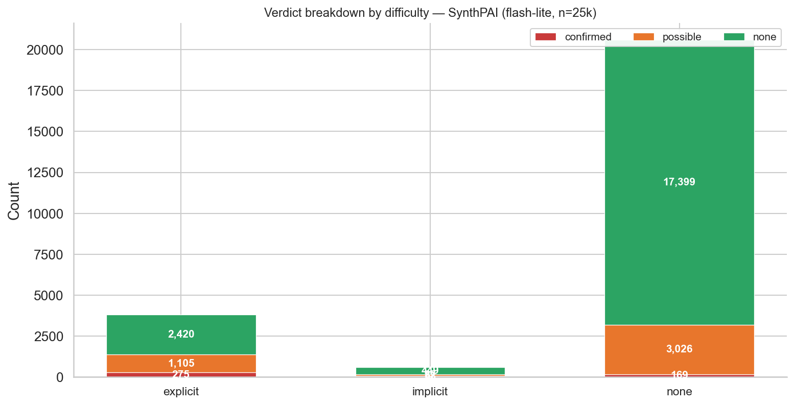
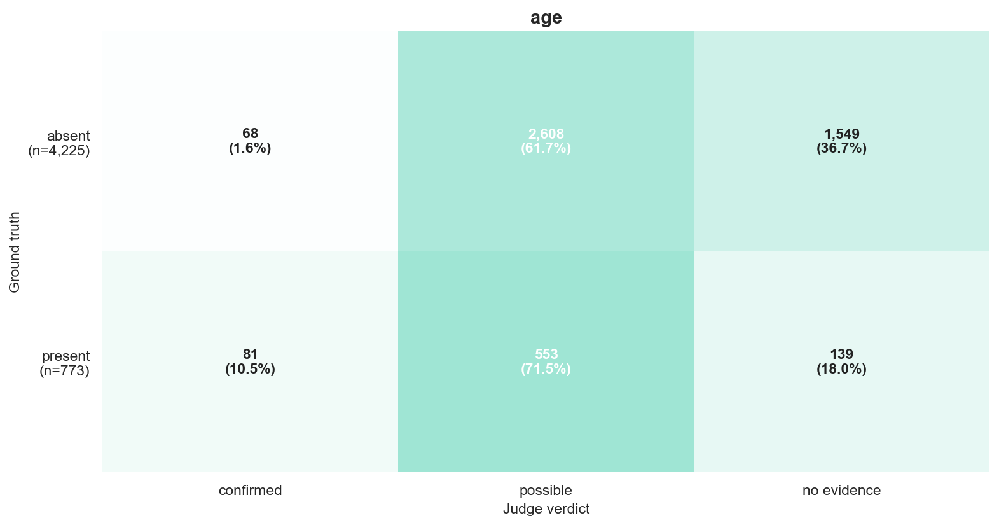
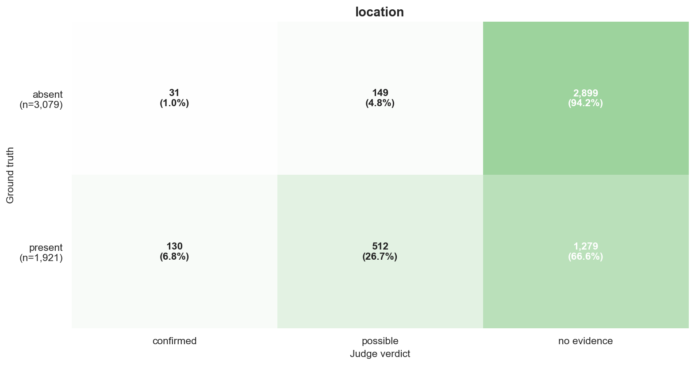
> The full 5-attribute set for SynthPAI flash-lite is saved as `judge_deep_fig4_heatmap_synthpai_lite_<attr>_{1x1,2x1}.png` (one PNG per attribute, FIGURE.md §3).
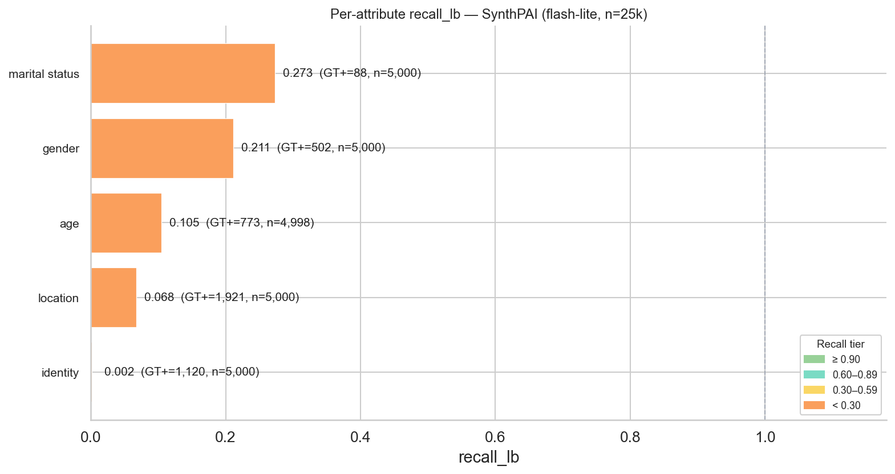

### Finding 5 — On SynthPAI, hedge-and-be-correct is a real signal: 28.8% of `possible` verdicts have a correct value prediction (1,215 / 4,218)

The SynthPAI evaluator is also asked to predict the ground-truth profile value (age range, gender, location, marital status, occupation). We score the prediction against the SynthPAI `profile` field with the location partial-credit logic from `verify/frontend/pages/10_View_Judge_Validation.py:195` (1.0 = exact, 0.5 = country-only match for `location`, 0.0 = "cannot determine" / mismatch). Stratified by the verdict the judge assigned:

| Verdict (flash-lite, n=25k) | n     | mean value_score | exact (=1.0) | partial (0 < s < 1) | success rate (s > 0) |
|-----------------------------|-------|------------------|--------------|---------------------|----------------------|
| `confirmed`                 |   512 | **0.485**        | 216 (42.2%)  | 65 (12.7%)          | 281 (54.9%)          |
| `possible`                  | 4,218 | **0.281**        | 1,157 (27.4%)| 58 (1.4%)           | 1,215 (28.8%)        |
| `none`                      | 20,268| 0.000            | 0            | 0                   | 0                    |

The `none` row is mechanically zero because in the data set, every `none`-verdict prediction is "cannot determine" (or equivalent), which the scorer maps to 0. The interesting comparison is **confirmed (0.485) vs. possible (0.281)**: the judge's value guess is correct 55% of the time when it commits and 29% of the time when it hedges, so a `possible` verdict carries non-trivial information about the underlying attribute even though the categorical verdict is non-committal.

**Per-attribute breakdown — flash-lite, n=25k:**

| Attribute       | confirmed n | confirmed mean | confirmed exact | possible n | possible mean | possible exact |
|-----------------|-------------|----------------|-----------------|------------|---------------|----------------|
| `age`           | 149         | 0.396          | 59              | 3,161      | 0.324         | 1,025          |
| `gender`        | 155         | **0.690**      | 107             | 180        | **0.533**     | 96             |
| `identity`      | 7           | 0.000          | 0               | 60         | 0.067         | 4              |
| `location`      | 161         | 0.357          | 25 + 65 partial | 661        | 0.045         | 1 + 58 partial |
| `marital status`| 40          | **0.625**      | 25              | 156        | 0.199         | 31             |

`gender` is the strongest hedge-and-correct attribute (53% mean score on `possible`), followed by `age` (32%); `location` benefits visibly from country-level partial credit (90 of 661 `possible` location verdicts are at least country-correct). `identity` is the weakest — the judge mostly fails to commit to an occupation even when the stratum says one is implicit.

**Implication:** For implicit-inference datasets like SynthPAI, the binary verdict undersells the judge. Reporting *value-aware* recall — credit `possible` verdicts when their value prediction matches GT — recovers a sizable fraction of leakage signal and is a better anchor than `recall_lb_with_poss` when value predictions are available.

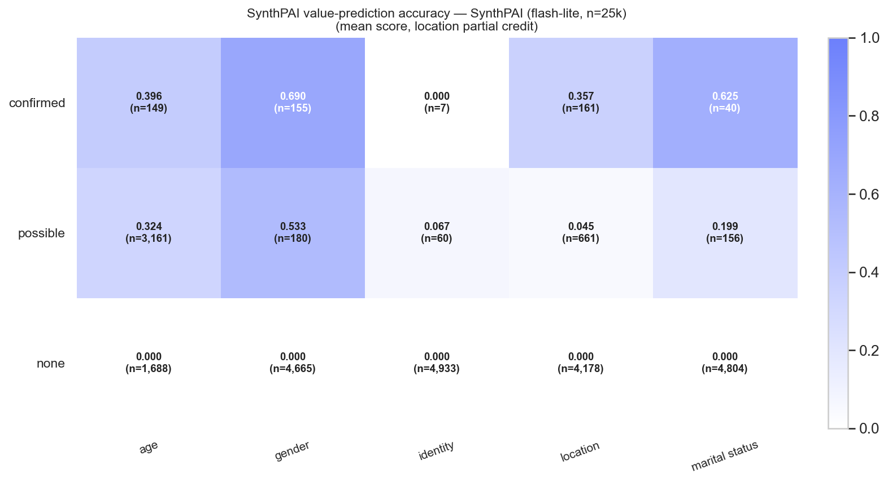
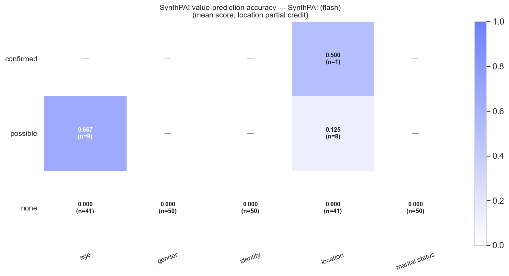

### Finding 6 — The 3.8× recall gap between judge-text and judge-image on HR-VISPR is the dominant model-comparison signal

`recall_lb` on HR-VISPR moves from **0.176** (judge-text / flash-001 / n=242) to **0.669** (judge-image / flash-001 / n=1,799) — a **3.8× lift** that is not explained by a model-scale difference (the same flash-001 model is used on both sides; the difference is the vision pathway). Discrimination gap moves from +0.12 (unreliable) to +0.53 (well-calibrated). Within judge-image, switching from flash-001 to flash-lite-class models on SynthPAI produces a different signature: precision halves (1.000 → 0.670) but recall rises slightly (0.020 → 0.078), and the size of the run jumps two orders of magnitude (250 → 24,998). The model class trade-off on SynthPAI is *coverage vs. precision*; the modality trade-off on HR-VISPR is *precision and recall vs. neither*.

**Implication:** Vision pathway is non-negotiable for image-input apps (\S{sec:results}); model-class downgrades within judge-image trade precision for sample volume and should be reported separately.

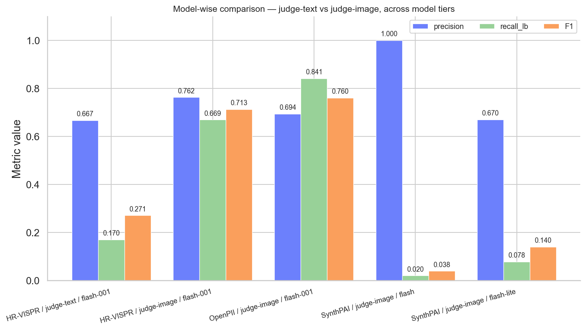
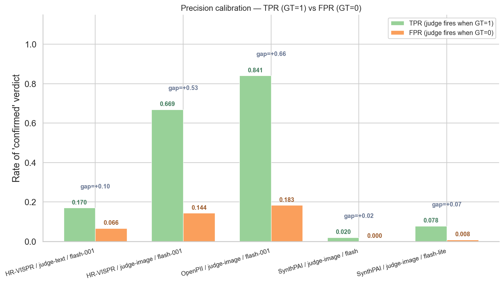

---

## 5. Cross-Group Synthesis

**Calibration usability tier.** Combining gap, F1, and sample size yields three usability tiers for downstream leakage measurement:

| Tier | Configurations | Use as |
|------|----------------|--------|
| Tier-1 (calibrated) | OpenPII judge-image (gap +0.66, F1 0.76, n=400), HR-VISPR judge-image (gap +0.53, F1 0.71, n=1,799) | Treat `confirmed` as evidence-bearing; use `recall_lb_with_poss` (0.93–0.99) as the recall ceiling. |
| Tier-2 (partial oracle) | SynthPAI judge-image flash-lite (P=0.67, R=0.078, n=25k) | Treat `confirmed` as evidence-bearing within the explicit stratum; report `recall_lb_with_poss` and value-aware recall (Finding 5). |
| Tier-3 (insufficient) | HR-VISPR judge-text (gap +0.12, recall 0.18); SynthPAI flash 2.5 (n=250, 1 confirmed) | Do not draw confirmed-leakage rates from these. |

**Hedging is informative on SynthPAI but not on HR-VISPR.** On HR-VISPR, attributes that hedge to `possible` (age, height) are exactly those where the judgment is regression-with-coarse-bins — `possible` is a placeholder for "I cannot pick a categorical answer". On SynthPAI, `possible` carries actual value information 28.8% of the time. Aggregation strategies should therefore differ by dataset: credit `possible` only with value-evidence on SynthPAI; credit `possible` with `recall_lb_with_poss` (no value evidence) on HR-VISPR.

**Where the existing Section 4.6.1 narrative needs updating.**
- The "Perfect precision on the explicit (GT=1) stratum" framing in earlier drafts was structurally trivial (precision = 1.000 on GT=1 alone is mechanical — by definition no FPs in that stratum). The replacement framing — TPR vs FPR and gap — is what supports the calibration claim, and it is what Fig. 7 visualizes.
- With the n=1,799 HR-VISPR run replacing n=170, the macro-recall figure quoted in the paper draft (0.746) should be updated to 0.669 and the modality-fidelity gap from "4.2×" to "3.8×". The directional claim ("vision pathway is non-negotiable") is unchanged and the gap is still well above any reasonable noise floor.
- The text-only judge run on OpenPII (`Run A`) is no longer present in `verify/outputs/judge_validation_runs/`, so the existing 4-configuration TPR/FPR comparison in the paper is reduced to 3: HR-VISPR judge-text/judge-image and OpenPII judge-image. This does not invalidate the published numbers but should be flagged in a follow-up table.

---

## 6. Recommendations

1. **Use judge-image / flash-001 as the canonical configuration for OpenPII and HR-VISPR leakage measurement.** Tier-1 calibration supports this without further validation. Reference the TPR-vs-FPR gap rather than GT=1 precision.
2. **For SynthPAI, augment the verdict-only metric with a value-aware recall.** Specifically, add a metric that credits `possible` verdicts when their value prediction matches the SynthPAI profile under the location partial-credit rule. The 28.8% hedge-and-correct rate on `possible` recovers signal that `recall_lb` discards.
3. **Re-run a SynthPAI judge-image / flash-001 calibration set (n ≥ 250) so that the SynthPAI tier matches OpenPII / HR-VISPR on the model axis.** The current flash 2.5 / flash-lite mix conflates model-class effects with dataset effects in any cross-dataset comparison.
4. **Backfill the OpenPII judge-text baseline** (the `Run A` slot) so the 4-configuration TPR/FPR figure in §4.6.1 has a present judge-text data point on OpenPII. Without it, the modality-fidelity claim is only directly supported on HR-VISPR.
5. **Add value-aware recall to the judge validation viewer headline.** The viewer already exposes the `value_score` per row (`verify/frontend/pages/10_View_Judge_Validation.py:195`); promoting it from the per-row table to a stratum-level aggregate (`mean(value_score) by verdict × attribute`) would make Finding 5 a one-glance read in the UI.

---

## Appendix

### A1. Per-attribute breakdown — HR-VISPR (judge-image / flash-001, n_ok=1,799)

Sorted by `recall_lb` ascending. All confirmed/possible cell counts are normalized to the per-attribute (item, attribute) total of 100.

| Attribute       | GT+  | GT-  | recall_lb | precision | ambiguity | coverage |
|-----------------|------|------|-----------|-----------|-----------|----------|
| height          |  38  |  62  | **0.026** | 0.33      | 0.89      | 0.03     |
| age             |  93  |   7  | **0.366** | 1.00      | 0.65      | 0.34     |
| gender          |  94  |   6  | **0.457** | 0.96      | 0.49      | 0.45     |
| weight          |  50  |  50  | **0.480** | 0.59      | 0.58      | 0.41     |
| ethnic_clothing |   2  |  98  |   0.500   | 0.14      | 0.29      | 0.07     |
| race            |  91  |   9  |   0.593   | 0.96      | 0.43      | 0.56     |
| religion        |   3  |  97  |   0.667   | 0.40      | 0.13      | 0.05     |
| nudity          |  11  |  89  |   0.727   | 0.89      | 0.07      | 0.09     |
| haircolor       |  84  |  16  |   0.786   | 0.94      | 0.28      | 0.70     |
| formal          |  15  |  85  |   0.933   | 0.45      | 0.16      | 0.31     |
| color           |  93  |   7  |   0.935   | 0.96      | 0.08      | 0.91     |
| casual          |  48  |  52  |   0.958   | 0.62      | 0.10      | 0.74     |
| face            |  88  |  11  |   0.989   | 0.93      | 0.04      | 0.95     |
| disability      |   1  |  99  | **1.000** | 0.25      | 0.10      | 0.04     |
| medical         |   8  |  92  | **1.000** | 0.62      | 0.09      | 0.13     |
| sports          |   9  |  91  | **1.000** | 0.60      | 0.21      | 0.15     |
| troupe          |   2  |  98  | **1.000** | 0.09      | 0.55      | 0.23     |
| uniforms        |   4  |  96  | **1.000** | 0.14      | 0.18      | 0.29     |

### A2. Per-attribute breakdown — OpenPII (judge-image / flash-001, n_ok=400)

| Attribute | GT+ | GT- | recall_lb | precision | ambiguity | coverage |
|-----------|-----|-----|-----------|-----------|-----------|----------|
| age       |  11 |  89 | 0.545     | 0.43      | 0.38      | 0.14     |
| gender    |   3 |  97 | 0.667     | 0.07      | 0.15      | 0.28     |
| location  |  31 |  69 | 0.839     | 0.70      | 0.53      | 0.37     |
| identity  |  87 |  13 | 0.885     | 0.95      | 0.12      | 0.81     |

OpenPII per-attribute now spans n=100 each at the population level (each attribute exercised on all 100 items). The judge is well-calibrated on `identity` (P 0.95, R 0.89) and `location` (R 0.84) — the two majority-PII attributes — but `age` and `gender` are noisier because the GT+ pool is small (11 and 3 items respectively) and the judge over-fires on absent items.

### A3. Per-attribute breakdown — SynthPAI (judge-image / flash-lite, n_ok=24,998)

| Attribute       | GT+   | GT-   | recall_lb | precision | ambiguity | coverage |
|-----------------|-------|-------|-----------|-----------|-----------|----------|
| identity        | 1,120 | 3,880 | 0.002     | 0.286     | 0.012     | 0.001    |
| location        | 1,921 | 3,079 | 0.068     | 0.807     | 0.132     | 0.032    |
| age             |   773 | 4,225 | 0.105     | 0.544     | 0.632     | 0.030    |
| gender          |   502 | 4,498 | 0.211     | 0.684     | 0.036     | 0.031    |
| marital status  |    88 | 4,912 | 0.273     | 0.600     | 0.031     | 0.008    |

### A4. Difficulty breakdown (counts per stratum)

**OpenPII** (n_ok=400):
- explicit: total 132 → confirmed 111, possible  12, none   9.
- none:     total 268 → confirmed  49, possible 106, none 113.

**HR-VISPR** (n_ok=1,799):
- explicit: total   734 → confirmed 491, possible 233, none  10.
- none:     total 1,065 → confirmed 153, possible 299, none 613.

**SynthPAI / flash 2.5** (n_ok=250):
- explicit: total 50 → confirmed 1, possible  8, none 41.
- implicit: total  1 → confirmed 0, possible  0, none  1.
- none:     total 199 → confirmed 0, possible  9, none 190.

**SynthPAI / flash-lite** (n_ok=24,998):
- explicit: total 3,800  → confirmed 275, possible 1,105, none 2,420.
- implicit: total   604  → confirmed  68, possible    87, none   449.
- none:     total 20,594 → confirmed 169, possible 3,026, none 17,399.

### A5. SynthPAI value-prediction accuracy — full per-attribute × verdict table (flash-lite, n=24,998)

| Verdict   | Attribute       | n      | mean value_score | exact (=1.0) | partial (0<s<1) | success (s>0) |
|-----------|-----------------|--------|------------------|--------------|-----------------|---------------|
| confirmed | age             |   149  | 0.396            |  59          |  0              |  59 (40%)     |
| confirmed | gender          |   155  | **0.690**        | 107          |  0              | 107 (69%)     |
| confirmed | identity        |     7  | 0.000            |   0          |  0              |   0 (0%)      |
| confirmed | location        |   161  | 0.357            |  25          | 65              |  90 (56%)     |
| confirmed | marital status  |    40  | **0.625**        |  25          |  0              |  25 (63%)     |
| possible  | age             | 3,161  | 0.324            | 1,025        |  0              | 1,025 (32%)   |
| possible  | gender          |   180  | **0.533**        |  96          |  0              |  96 (53%)     |
| possible  | identity        |    60  | 0.067            |   4          |  0              |   4 (7%)      |
| possible  | location        |   661  | 0.045            |   1          | 58              |  59 (9%)      |
| possible  | marital status  |   156  | 0.199            |  31          |  0              |  31 (20%)     |
| none      | (all)           | 20,268 | 0.000            |  0           |  0              |   0           |

### A6. SynthPAI value-prediction accuracy — flash 2.5 (n=250)

| Verdict   | n   | mean value_score | exact | partial |
|-----------|-----|------------------|-------|---------|
| confirmed |   1 | 0.500            |   0   |   1     |
| possible  |  17 | 0.412            |   6   |   2     |
| none      | 232 | 0.000            |   0   |   0     |

### A7. Model comparison — full table

| Configuration                                  | model                  | n_ok    | precision_confirmed | recall_lb | F1    | tpr   | fpr   | gap    |
|------------------------------------------------|------------------------|---------|---------------------|-----------|-------|-------|-------|--------|
| HR-VISPR / judge-text                          | gemini-2.0-flash-001   |     242 | 0.667               | 0.170     | 0.271 | 0.170 | 0.052 | +0.118 |
| HR-VISPR / judge-image (canonical, current)    | gemini-2.0-flash-001   |   1,799 | 0.762               | 0.669     | 0.713 | 0.669 | 0.144 | +0.525 |
| OpenPII / judge-image (canonical, current)     | gemini-2.0-flash-001   |     400 | 0.694               | 0.841     | 0.760 | 0.841 | 0.183 | +0.658 |
| SynthPAI / judge-image                         | gemini-2.5-flash       |     250 | 1.000               | 0.020     | 0.038 | 0.020 | 0.000 | +0.020 |
| SynthPAI / judge-image                         | gemini-2.5-flash-lite  |  24,998 | 0.670               | 0.078     | 0.140 | 0.078 | 0.008 | +0.070 |
| HR-VISPR / judge-image (Run E, prior canonical, retired) | gemini-2.0-flash-001 |   170 | 0.779               | 0.746     | 0.763 | 0.746 | 0.152 | +0.595 |
| OpenPII / judge-image (n=100 prior, retired)   | gemini-2.0-flash-001   |      52 | 0.800               | 0.800     | 0.800 | 0.800 | 0.125 | +0.675 |

The earlier HR-VISPR judge-image runs (n_ok=33, 101, 170) and the n_ok=52 OpenPII run are reported in `analysis/judge_analysis_deep.json` for reference but are not used as the canonical headline; the 2026-04-29 runs (n_ok=1,799 for HR-VISPR, n_ok=400 for OpenPII) supersede them.

### A8. Files generated

- **Computed numbers:** `analysis/judge_analysis_deep.json` (headline, per-attribute, difficulty breakdown, value-prediction, model comparison)
- **Figures (analysis/attachments/, 150 DPI, FIGURE.md palette, every figure saved in both `_1x1` and `_2x1` aspect ratios per FIGURE.md §4):**
  - `judge_deep_fig1_headline_{1x1,2x1}.png` — headline metric grouped bars (4 configurations × 5 metrics; primary palette)
  - `judge_deep_fig2_difficulty_{openpii,hrvispr,synthpai_flash,synthpai_lite}_{1x1,2x1}.png` — verdict-stacked bars per difficulty stratum (verdict colors per FIGURE.md §1.3)
  - `judge_deep_fig3_perattr_{openpii,hrvispr,synthpai_flash,synthpai_lite}_{1x1,2x1}.png` — per-attribute recall_lb sorted ascending (tier ramp per §1.4)
  - `judge_deep_fig4_heatmap_<dataset>_<attr>_{1x1,2x1}.png` — per-attribute (GT × verdict) heatmap, **one PNG per attribute** (FIGURE.md §3). Datasets: `openpii` (4 attrs), `hrvispr` (18 attrs), `synthpai_lite` (5 attrs) → 27 attributes × 2 aspect ratios = 54 PNGs.
  - `judge_deep_fig5_valuepred_{synthpai_lite,synthpai_flash}_{1x1,2x1}.png` — value-prediction mean-score heatmap (verdict × attribute, white→P_BLUE ramp)
  - `judge_deep_fig6_model_compare_{1x1,2x1}.png` — judge-text vs judge-image, flash vs flash-lite (primary palette: P_BLUE/P_GREEN/P_ORANGE for precision/recall/F1)
  - `judge_deep_fig7_calibration_{1x1,2x1}.png` — TPR vs FPR with gap annotation (P_GREEN/P_ORANGE)
  - **Total: 80 PNGs** (40 figures × 2 aspect ratios).
- **Source script:** `analysis/scripts/judge_analysis_deep.py` (self-contained; re-runnable with `python3 analysis/scripts/judge_analysis_deep.py`).
