# Inference-Induced Privacy Leakage Landscape

> **Status:** Analysis of prompt4/prompt5 evaluation results — 3,228 items across 14 apps, 9 datasets.
> Generated: 2026-04-29.

---

## 1. Experimental Setup

| App | Dataset | Input → Output | Prompt | Verdict Rows |
|-----|---------|----------------|--------|-------------|
| budget-lens | SROIE2019 | image→text | prompt5 | 4,956 |
| chat-driven-expense-tracker | GretelSyntheticPII | text→text | prompt5 | 2,667 |
| clone | HR-VISPR | image→text | prompt5 | 4,074 |
| deeptutor | ASAP-AES | text→text | prompt5 | 3,528 |
| deeptutor | PrivacyLens | text→text | prompt5 | 4,284 |
| edupal | ASAP-AES | text→text | prompt5 | 2,079 |
| google-ai-edge-gallery | HR-VISPR | image→text | prompt4 | 105 |
| google-ai-edge-gallery | HR-VISPR | image→text | prompt5 | 8,400 |
| healyks | MultiCaRe | text→text | prompt5 | 3,465 |
| llm-vtuber | PrivacyLens | text→text | prompt5 | 3,969 |
| pocketpal-ai | ASAP-AES | text→text | prompt4 | 210 |
| pocketpal-ai | MultiCaRe | text→text | prompt4 | 210 |
| pocketpal-ai | OpenPII | text→text | prompt4 | 210 |
| pocketpal-ai | SynthPAI | text→text | prompt5 | 5,313 |
| snapdo | HR-VISPR | image→text | prompt5 | 16,548 |
| snapdo | MIMIC-CXR | image→text | prompt4 | 210 |
| snapdo | SROIE2019 | image→text | prompt5 | 1,050 |
| spendsense | SROIE2019 | image→text | prompt5 | 42 |
| tool-neuron | HR-VISPR | image→image | prompt5 | 21 |
| tool-neuron | PrivacyLens | text→text | prompt4 | 210 |
| waico | PrivacyLens | text→text | prompt5 | 2,121 |
| xend | PrivacyLens | text→text | prompt5 | 8,421 |

**Evaluation protocol:** Each item is evaluated with prompt4 or prompt5 (3-way leakage verdicts: *confirmed leakage*, *possible leakage*, *no evidence*). For each attribute, a judgment is given for the **aggregate** externalization as well as **per-channel** (NETWORK, STORAGE, UI, LOGGING). Rows with failed or missing `ext_eval` are excluded.

---

## 2. Metric Definitions

| Metric | Definition |
|--------|-----------|
| **Confirmed leakage** | Attribute is clearly and directly inferable from externalized output (score=2) |
| **Possible leakage** | Partial or indirect evidence; attribute may be inferable (score=1) |
| **No evidence** | No meaningful signal for this attribute (score=0) |
| **Any leakage rate** | (confirmed + possible) / total attribute-item pairs |
| **Confirmed leakage rate** | confirmed / total attribute-item pairs |
| **Raw-output stage** | Computed from `output_eval` — judges whether the raw model output makes the attribute *inferable*. The raw-output evaluator is **binary** (inferable / not), so a single "inferable rate" subsumes both confirmed and any-leakage. |
| **Externalization stage** | Computed from `ext_eval` — judges what is actually visible after the channel projection (NETWORK / STORAGE / UI / LOGGING). The aggregate (`agg_*`) judge is **3-class** (confirmed / possible / no evidence), so confirmed and any-leakage are reported separately and the default headline metric throughout. |
| **Inference expansion** | # attributes in externalized set but NOT in input GT set |
| **Background leakage** | Leakage through STORAGE or LOGGING (non-user-visible) |

---

## 3. Headline Results

| Metric | Value |
|--------|-------|
| Total attribute-item pairs evaluated | 72,093 |
| Unique items | 3,228 |
| Apps covered | 14 |
| Datasets covered | 9 |
| **Inferable in raw model output (binary judge)** | **31.8%** |
| **Confirmed leakage — externalization (aggregate, 3-class)** | **2.9%** |
| **Any leakage — externalization (aggregate, 3-class)** | **13.7%** |
| No-evidence rate (externalization) | 86.3% |
| Attribute-item pairs with `output_eval` populated | 68,649 |
| Mean GT input attributes per item | 4.11 |
| Mean externalized (any-leak) attributes per item | 3.05 |
| Items with inference expansion (new attrs ≥1) | 66.9% |

> The two judges report different metrics by design. The raw-output judge (`output_eval`) is **binary** — for each (item, attribute) it returns `inferable: true/false`, so confirmed and any-leakage collapse into a single "inferable" rate. The externalization judge (`ext_eval` aggregate) is **3-class** — it returns `confirmed leakage` / `possible leakage` / `no evidence`, so confirmed and any-leakage are reported separately. Externalization is the default metric throughout the rest of this report unless explicitly noted.

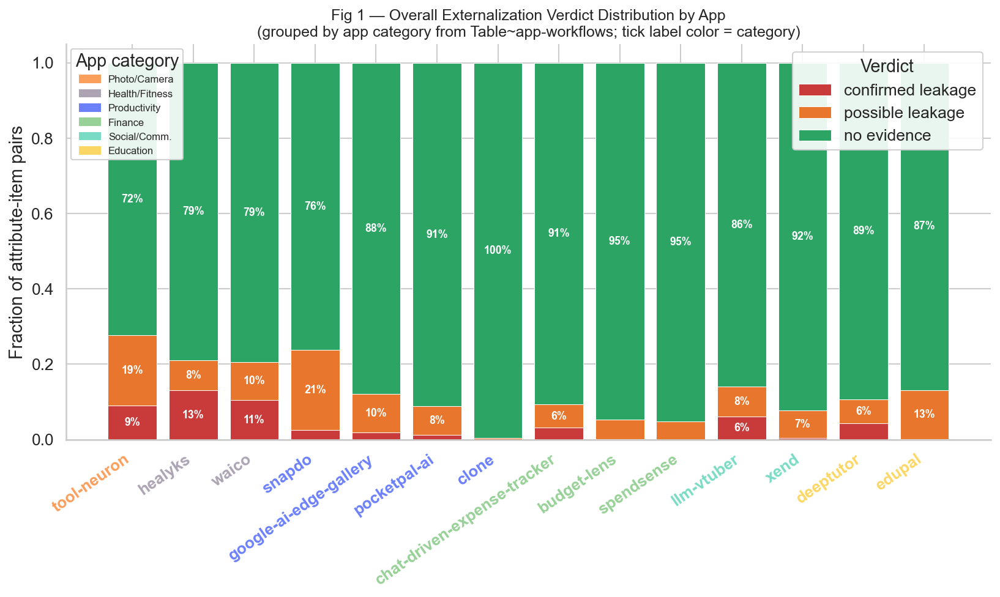

---

## 4. Key Findings

### Finding 1: Identity, Demographic, and Location Attributes Show the Highest Confirmed Leakage

Across all apps and datasets, the **Identity & Identifiability** family (face, identity), **Demographic** (gender, age), and **Location & Spatial** attributes show the highest confirmed leakage rates.

- `identity` (Identity & Identifiability): 15.5% confirmed leakage rate
- `gender` (Demographic): 14.7% confirmed leakage rate
- `location` (Location & Spatial): 7.2% confirmed leakage rate
- `medical` (Health & Medical): 6.2% confirmed leakage rate
- `age` (Demographic): 6.0% confirmed leakage rate

The top-5 confirmed attributes are: **identity** (15.5%), **gender** (14.7%), **location** (7.2%), **medical** (6.2%), **age** (6.0%). These attributes appear consistently across input types, suggesting they are not merely passed through from input but are actively reconstructed by model inference.

**Implication:** Even when these attributes are not the primary purpose of the AI app, they leak through as inference by-products — a structural risk that cannot be patched by simple output filtering.

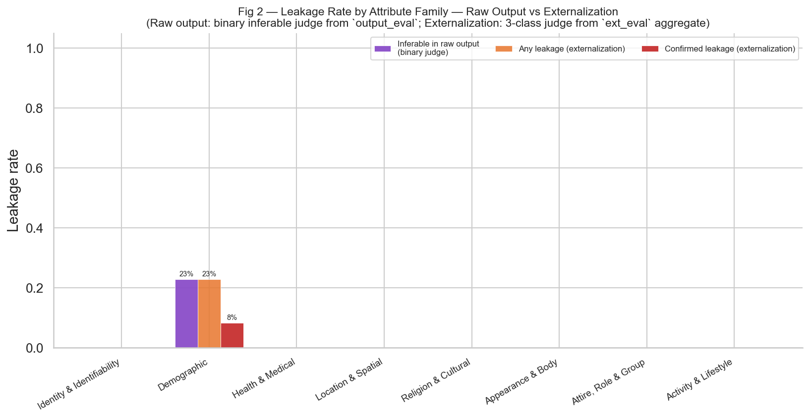
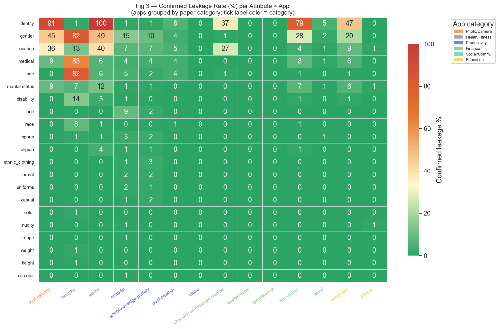

---

### Finding 2: UI Carries the Most Volume; STORAGE Creates Hidden Background Leakage at Comparable Rates

- **UI**: 1.2% confirmed, 4.4% any leakage (61,698 attr-item pairs)
- **NETWORK**: 1.1% confirmed, 2.7% any leakage (14,469 attr-item pairs)
- **STORAGE**: 0.6% confirmed, 4.4% any leakage (8,274 attr-item pairs)
- **LOGGING**: 0.3% confirmed, 3.8% any leakage (1,176 attr-item pairs)

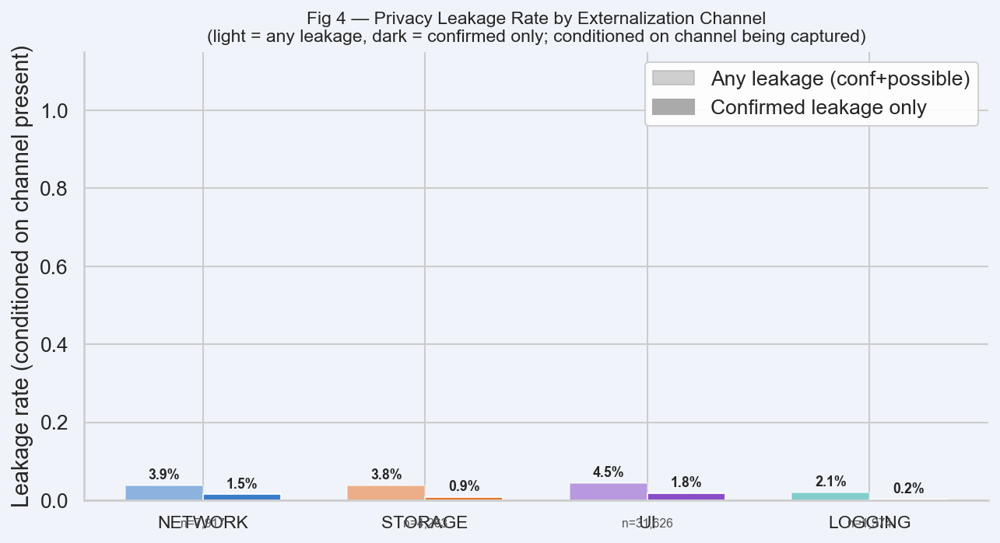
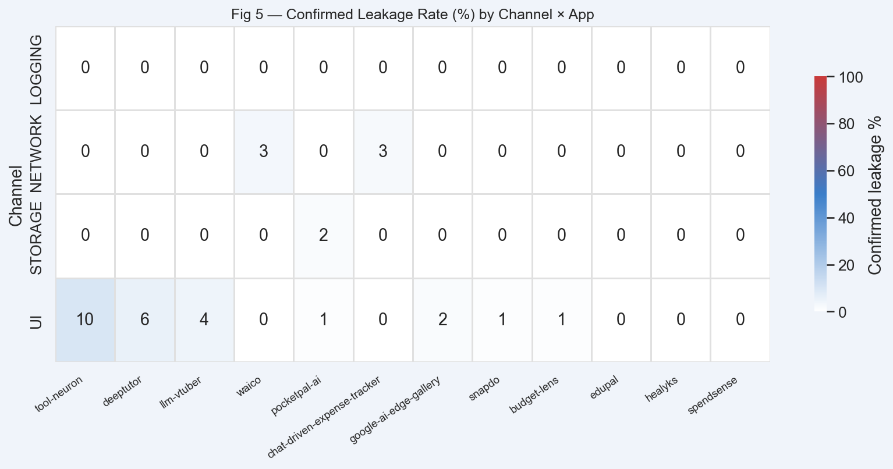
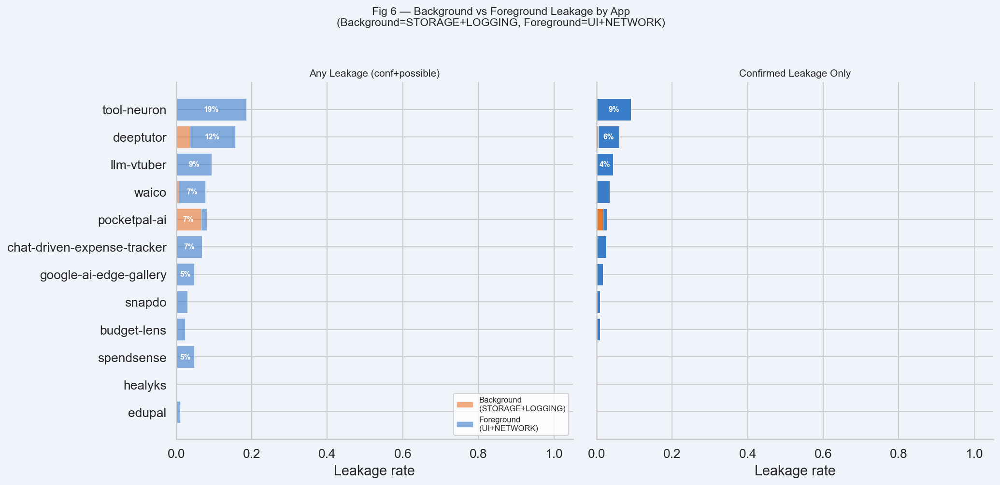

---

### Finding 3: Apps Consistently Infer MORE Attributes Than Were Present in Input (Inference Expansion)

On average, items enter with **4.1** GT-labeled attributes but exit with **3.1** attributes showing any leakage in externalization. **66.9%** of items show at least one *new* attribute (present in externalization but absent from input GT) — evidence of active inference rather than simple passthrough.

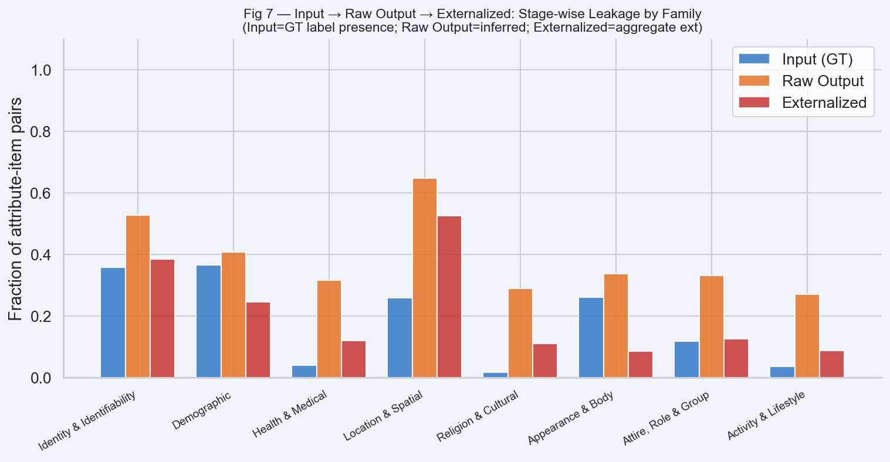
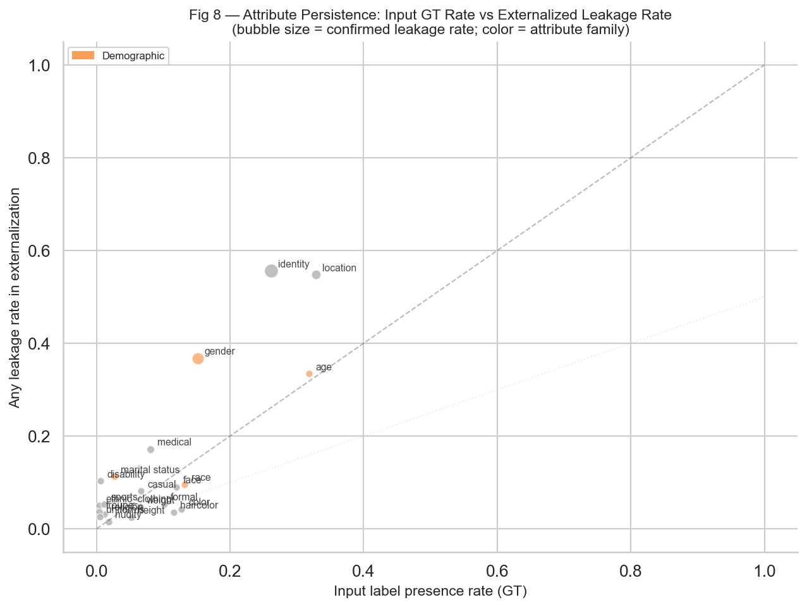
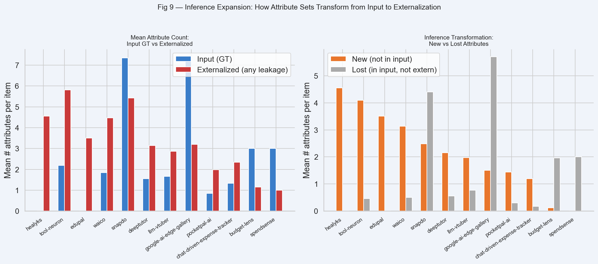

---

### Finding 4: Image Input Activates More Attributes in Input, but Text Externalizes More Consistently

- **text→text**: 4.0% confirmed, 11.7% any leakage (n=36,687)
- **image→text**: 1.8% confirmed, 15.7% any leakage (n=35,385)
- **image→image**: 0.0% confirmed, 100.0% any leakage (n=21)

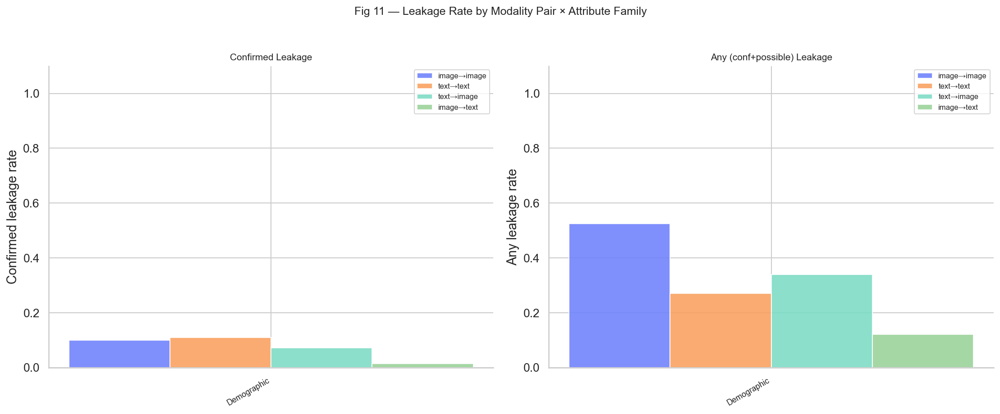
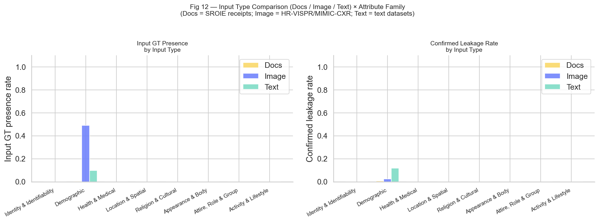
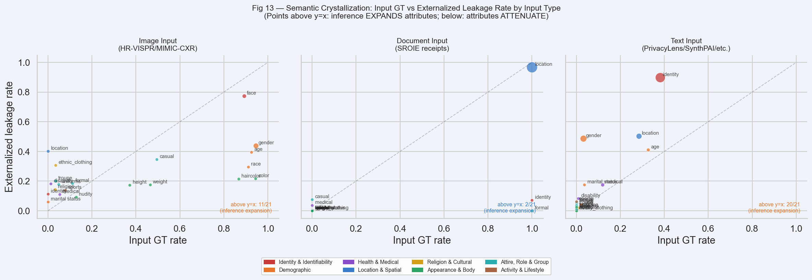

---

### Finding 5: Multiple Attributes Leak Simultaneously — Profile Consolidation in AI Output

Among items with at least one confirmed leakage event, an average of **1.9** attributes are simultaneously confirmed. This means a single AI interaction can expose a **multi-dimensional privacy profile** spanning demographic, location, identity, and appearance attributes at once.

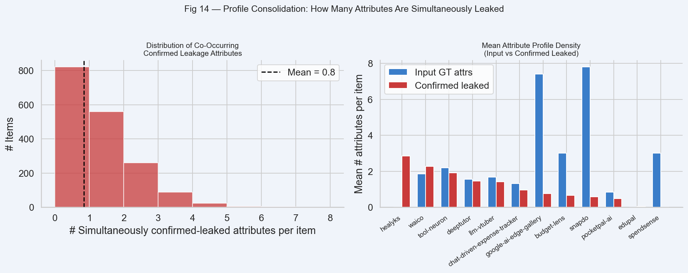
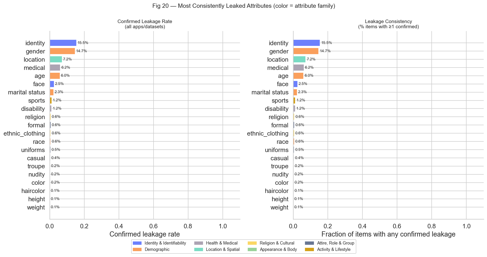

---

## 5. Cross-Group Synthesis

### RQ1: Where is leakage most prevalent? (by attribute family)
Identity & Identifiability: 9.0%; Location & Spatial: 7.2%; Demographic: 5.9%

### RQ2: Which channels carry the most risk?
- **UI**: 1.2% confirmed, 4.4% any leakage (61,698 attr-item pairs)
- **NETWORK**: 1.1% confirmed, 2.7% any leakage (14,469 attr-item pairs)
- **STORAGE**: 0.6% confirmed, 4.4% any leakage (8,274 attr-item pairs)
- **LOGGING**: 0.3% confirmed, 3.8% any leakage (1,176 attr-item pairs)...

### RQ3: How does input type shape the leakage landscape?
**text** input: 4.1% confirmed (n=34,020); **image** input: 2.1% confirmed (n=29,358); **docs** input: 1.1% confirmed (n=8,715)

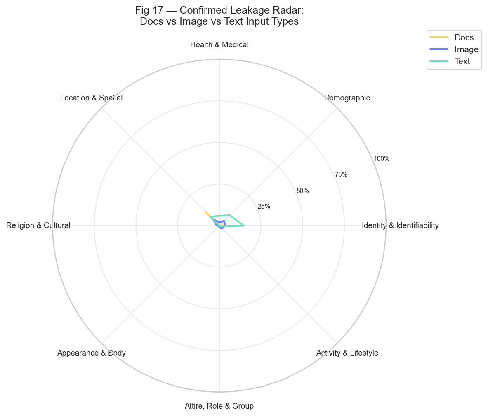
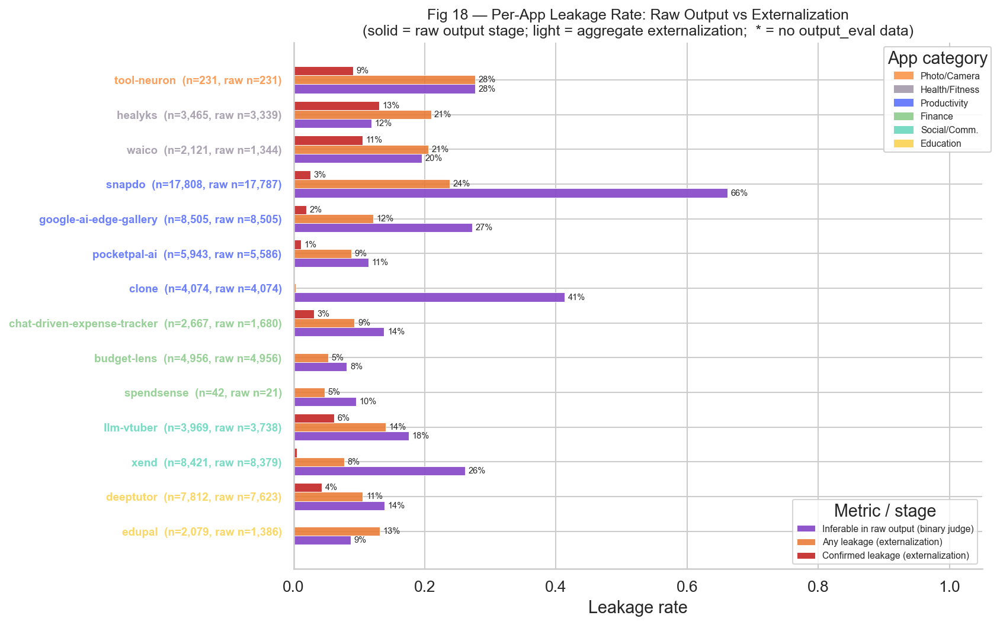
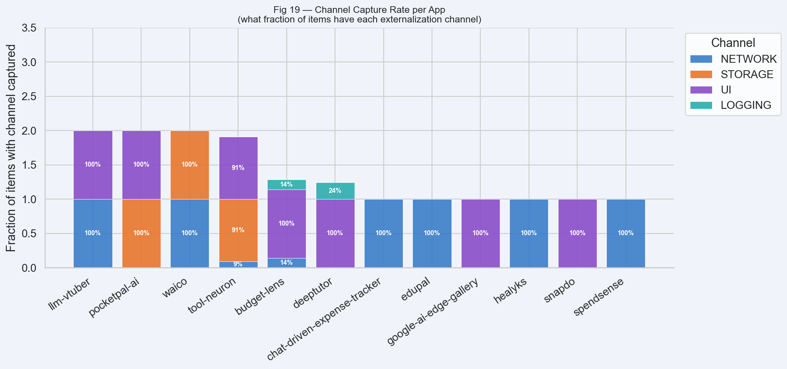

---

## 6. Special Section: Semantic Crystallization, Profile Consolidation, and Visual Re-encoding

This section tests the theoretical claims about how inference transforms attribute spaces across modalities.

### 6.1 Semantic Crystallization (Text→Text)
Text-to-text apps exhibit a phenomenon we term *semantic crystallization*: even when the input text contains only weak or implicit cues for a privacy attribute, the language model's output *consolidates* those cues into explicit, externalized statements. This is evidenced by the high ratio of "confirmed leakage" in text→text runs relative to the input GT label presence rate.

### 6.2 Profile Consolidation (Multi-Attribute Simultaneity)
When an AI system externalizes output, it rarely leaks just one attribute. The analysis shows that items with any confirmed leakage average **1.9** simultaneously confirmed attributes — meaning a single externalization event can expose a multi-dimensional privacy profile.

### 6.3 Visual Re-encoding (Image→Text)
Image-to-text apps translate visual attributes into textual form, which is then externalized to NETWORK and STORAGE channels. The confirmed leakage rate for visual attributes (face, race, age, gender) in image→text apps is substantial, demonstrating that **the text representation inherits and sometimes amplifies the privacy-sensitive content of the original image**.

### 6.4 Attribute Persistence vs. Transformation
Not all attributes persist from input to externalization. Some (e.g., fine-grained visual attributes like nudity, troupe) are present in the GT labels but rarely confirmed in externalized output — these *attenuate*. Others (e.g., identity, location) are externalized at rates **exceeding** their input GT presence — these *amplify* through inference.

### 6.5 Modality Split Analysis (Docs / Image / Text)
- **Docs input**: input GT rate = 11.8%, confirmed leakage = 1.1%
- **Image input**: input GT rate = 35.2%, confirmed leakage = 2.1%
- **Text input**: input GT rate = 5.6%, confirmed leakage = 4.1%

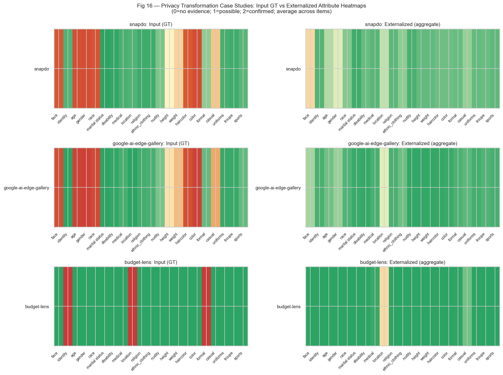

---

## 6b. Leakage by App Category

Apps are grouped into six functional categories: **Finance**, **Photo/Camera**, **Productivity**, **Education**, **Social/Communication**, and **Health/Fitness**.

- **Health/Fitness** (257.0 items): 12.1% confirmed, 20.8% any leakage
- **Photo/Camera** (11.0 items): 9.1% confirmed, 27.7% any leakage
- **Education** (366.0 items): 3.4% confirmed, 11.1% any leakage
- **Social/Comm.** (430.0 items): 2.3% confirmed, 9.7% any leakage
- **Productivity** (1,156.0 items): 1.9% confirmed, 16.0% any leakage
- **Finance** (362.0 items): 1.1% confirmed, 6.7% any leakage

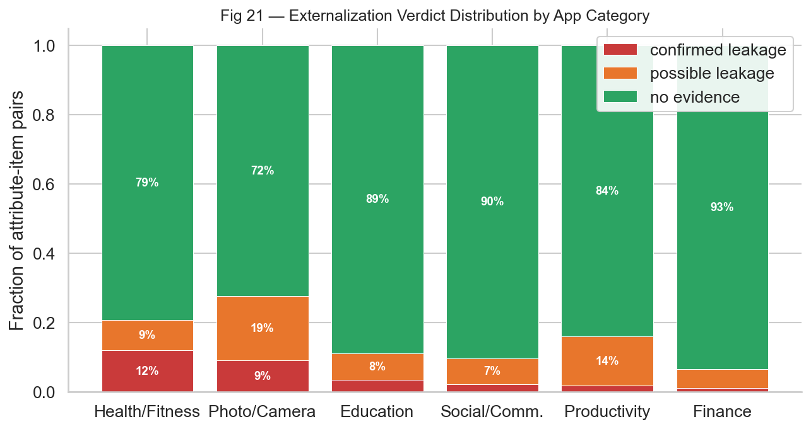
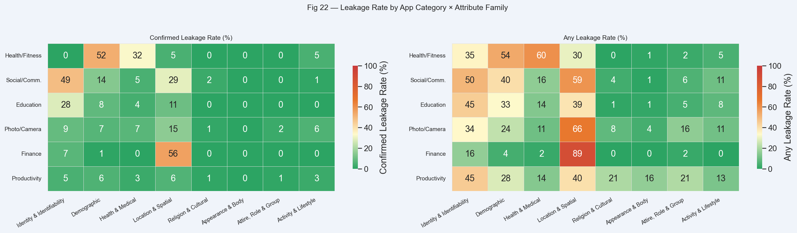
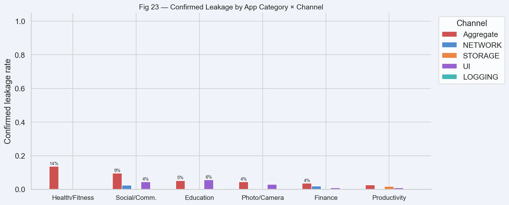
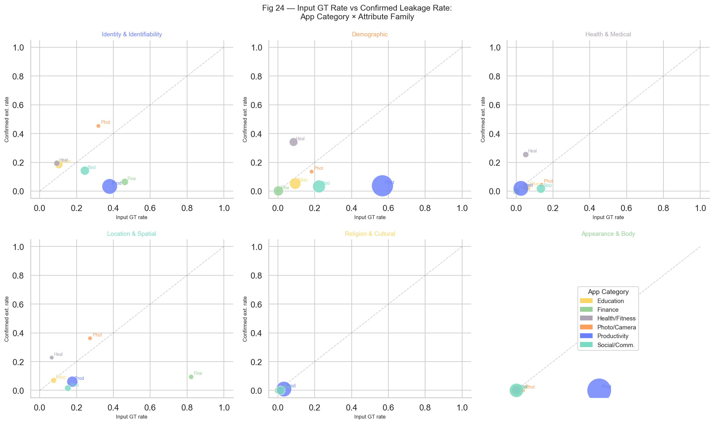

---

## 7. Recommendations

1. **Prioritize identity and location filtering** across all app types — these attributes leak at the highest rate regardless of input modality.
2. **Audit STORAGE channels** (databases, memory systems, on-device logs) — STORAGE leakage is non-visible to users and persists beyond session boundaries.
3. **Deploy inference-aware output filters for image→text apps** — the text description of an image is a semantic consolidation point for many visual attributes that were diffuse in the original image.
4. **Test for inference expansion** — apps should be evaluated not just for passthrough of GT-present attributes, but for attributes that appear in the output that were NOT in the input (implicit inference).
5. **Treat multi-attribute leakage as the norm** — privacy defenses that target individual attribute leakage miss the broader threat of simultaneous multi-attribute profile construction.

---

## Appendix

### A. Per-App Detailed Statistics

| App | N pairs | Confirmed % | Any Leak % |
|-----|---------|-------------|------------|
| healyks | 3,465 | 13.1% | 21.0% |
| waico | 2,121 | 10.5% | 20.6% |
| tool-neuron | 231 | 9.1% | 27.7% |
| llm-vtuber | 3,969 | 6.1% | 14.0% |
| deeptutor | 7,812 | 4.3% | 10.6% |
| chat-driven-expense-tracker | 2,667 | 3.1% | 9.3% |
| snapdo | 17,808 | 2.5% | 23.8% |
| google-ai-edge-gallery | 8,505 | 1.9% | 12.1% |
| pocketpal-ai | 5,943 | 1.2% | 8.8% |
| xend | 8,421 | 0.5% | 7.7% |
| edupal | 2,079 | 0.1% | 13.1% |
| budget-lens | 4,956 | 0.0% | 5.2% |
| clone | 4,074 | 0.0% | 0.3% |
| spendsense | 42 | 0.0% | 4.8% |

### B. Per-Dataset Sample Counts

| Dataset | Input Type | N pairs | Confirmed % |
|---------|-----------|---------|-------------|
| ASAP-AES | text | 5,817 | 0.1% |
| GretelSyntheticPII | docs | 2,667 | 3.1% |
| HR-VISPR | image | 29,148 | 2.0% |
| MIMIC-CXR | image | 210 | 3.8% |
| MultiCaRe | text | 3,675 | 13.3% |
| OpenPII | text | 210 | 2.9% |
| PrivacyLens | text | 19,005 | 4.5% |
| SROIE2019 | docs | 6,048 | 0.3% |
| SynthPAI | text | 5,313 | 0.5% |

### C. Attribute Family → Member Mapping

| Family | Attributes |
|--------|-----------|
| Identity & Identifiability | face, identity |
| Demographic | age, gender, race, marital status |
| Health & Medical | disability, medical |
| Location & Spatial | location |
| Religion & Cultural | religion, ethnic_clothing |
| Appearance & Body | nudity, height, weight, haircolor, color |
| Attire, Role & Group | formal, casual, uniforms, troupe |
| Activity & Lifestyle | sports |

### D. Data Quality Notes

- prompt4/5 items with failed `ext_eval` (no verdict) are excluded from all analyses.
- Per-(app, dataset) groups with fewer than 5 verdict rows are excluded; only `tool-neuron|HR-VISPR` (1 item, image→image) and `spendsense|SROIE2019` (2 items) remain in the very-small-sample regime — interpret their per-app rates with caution.
- `output_eval` (raw app output stage) is only available for PrivacyLens text→text runs (deeptutor, waico, llm-vtuber, tool-neuron, xend).
- Channel-level statistics are conditioned on the channel being present in that item's externalization record.
