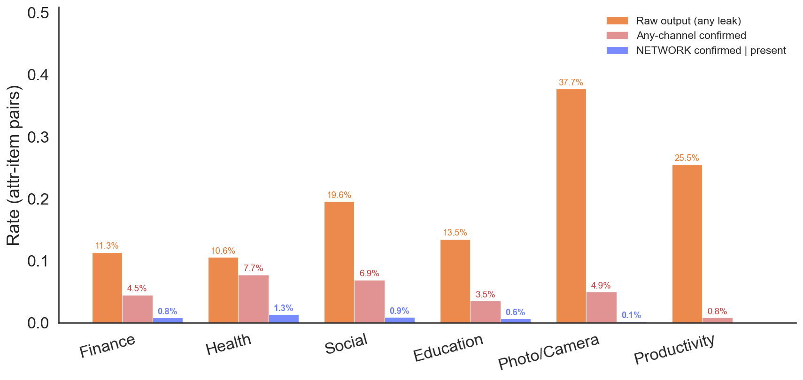
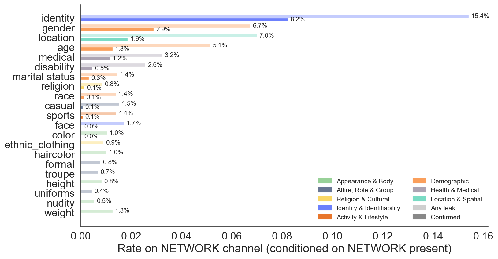
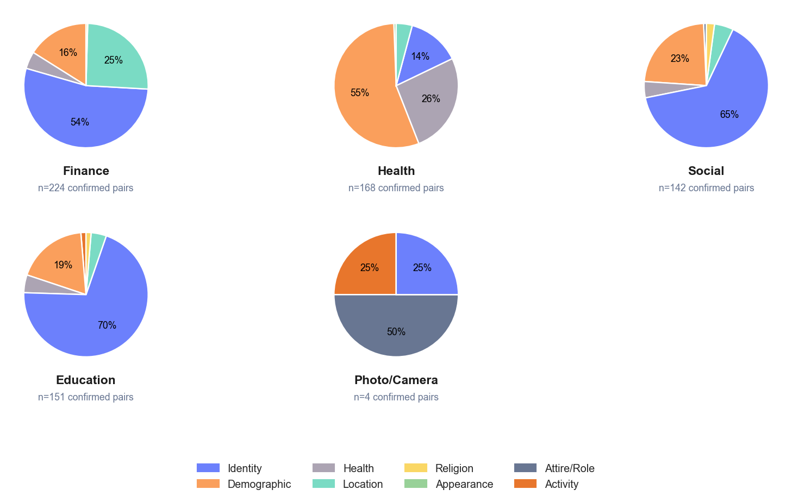
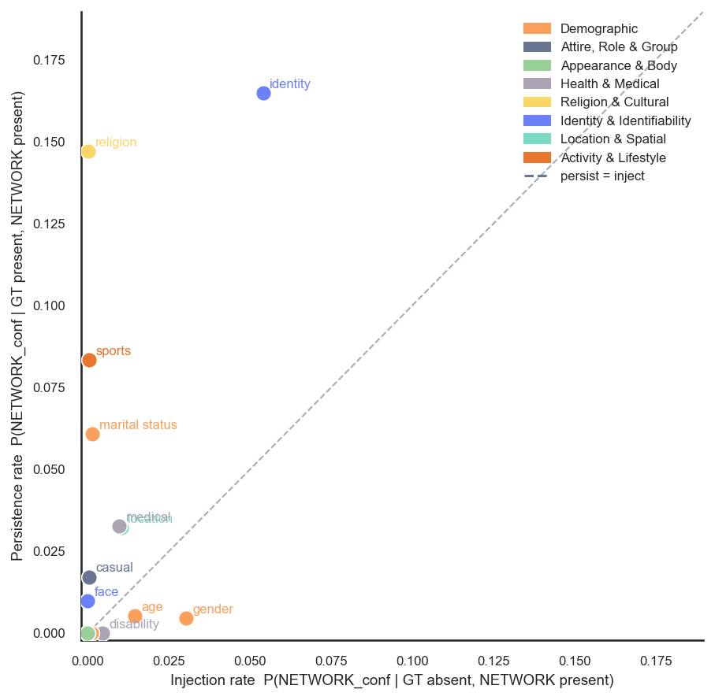
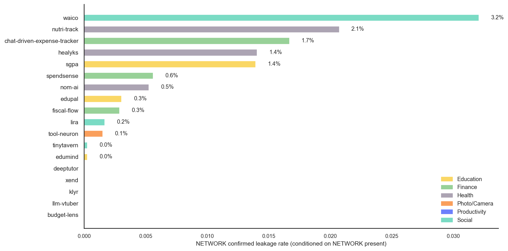
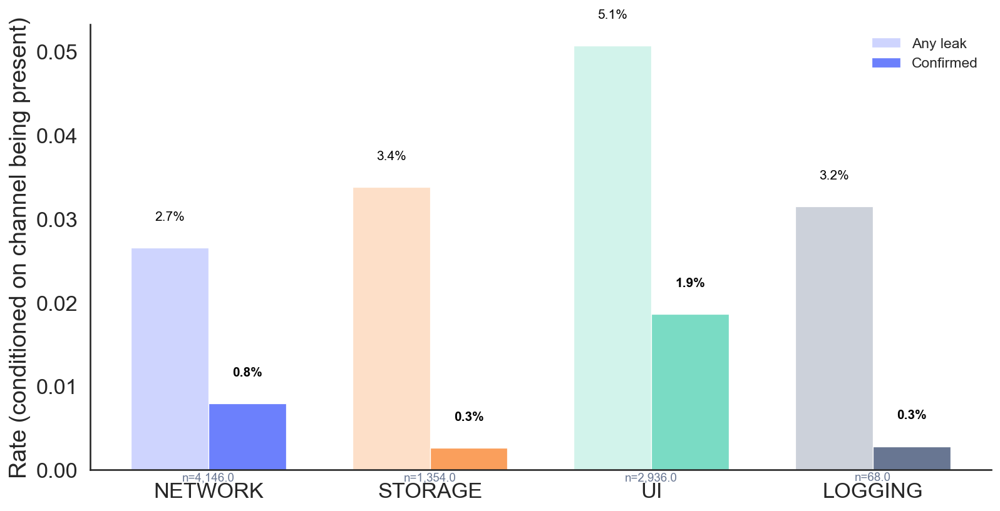
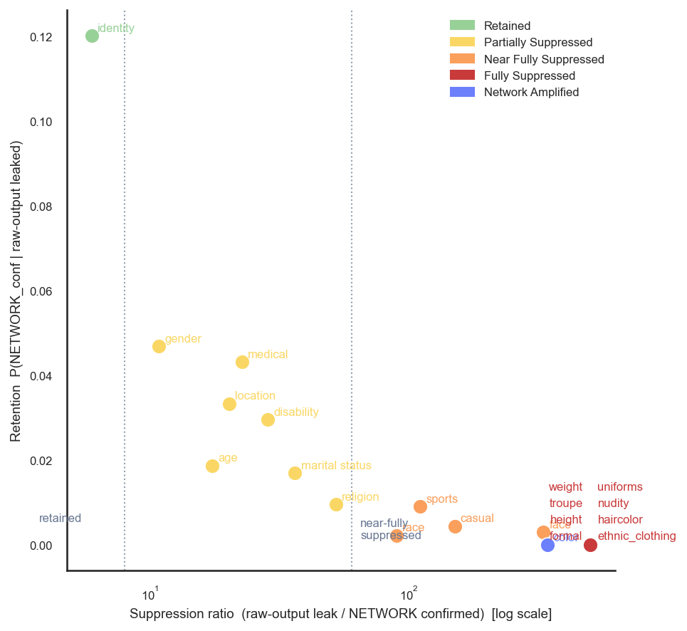
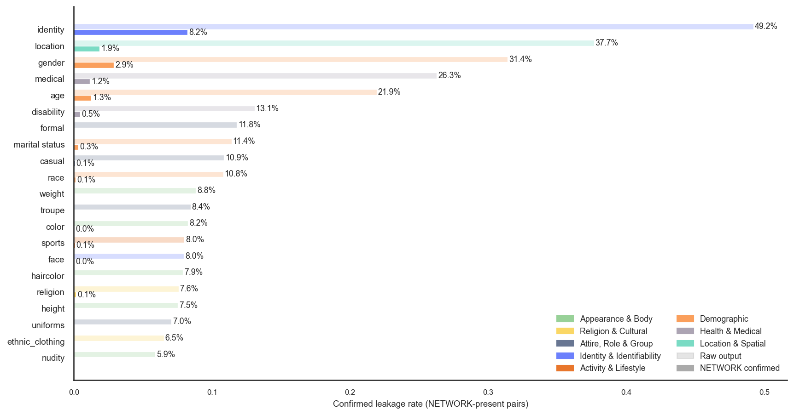

# Network-Channel Privacy Leakage — Stage Gaps and Invariant Results

> **Status:** Final — 144,396 attr-item pairs across 6,876 unique items, 24 apps, 10 datasets.
> Generated: 2026-05-06. Analysis scoped exclusively to the **NETWORK channel**.

---

## 1. Experimental Setup

The Lantern evaluation pipeline captures app behavior across four externalization
channels: **NETWORK**, **UI**, **STORAGE**, and **LOGGING**. This analysis focuses
exclusively on the **NETWORK** channel — outbound HTTP/API calls carrying private
attribute signals.

| Metric | Value |
|--------|-------|
| Attr-item pairs evaluated | **144,396** |
| Unique items | **6,876** |
| Apps covered | **24** |
| Datasets | **10** |
| NETWORK-present attr-item pairs | **87,066** (60% of all) |
| Unique items with NETWORK captured | **4,146** |
| Apps with ≥1 NETWORK item | **18** |
| Apps with zero NETWORK presence | **6** (clone, google-ai-edge-gallery, momentag, pocketpal-ai, skin-disease-detection, snapdo) |

**Stage definitions.**
1. **Raw output** — attribute signal present in the LLM's direct textual response
   (`output_eval`).
2. **Any-channel confirmed** — attribute confirmed leaked on at least one captured
   channel (`ext_conf`).
3. **NETWORK confirmed | present** — attribute confirmed leaked specifically on
   the NETWORK channel, conditioned on the channel being present.

All leakage rates are computed over (item, attribute) pairs. Channel-level rates
are **conditioned on the channel being present** (i.e., the app made at least one
network call in that run) to avoid dilution from structurally absent channels.

---

## 2. Headline Numbers

| Metric | Rate |
|--------|------|
| Raw output any-leak (all pairs) | **18.9%** |
| Any-channel confirmed (all pairs) | **4.2%** |
| NETWORK confirmed \| present | **0.79%** |
| NETWORK any-leak \| present | **2.66%** |
| Minimum raw→NETWORK compression | **7.9× (Health)** |

The NETWORK channel is the most disciplined externalization point: models
infer private attributes at 18.9% in raw output, but only
0.79% of attribute-item pairs on the NETWORK channel receive a
confirmed-leakage verdict — a compression of at least **7.9× in every
single app category**.

---

## 3. Key Findings

### Finding 1 — The raw→NETWORK stage gap is an invariant across all categories

In every app category, the raw-output leak rate exceeds the NETWORK confirmed
rate by at least 7.9×. The gap ranges from 7.9× (Health)
to effectively infinite (Productivity: 25.5% raw → 0.0% NETWORK). This means
the NETWORK channel is **not** a simple pass-through of the model's inference.

| Category | N pairs | Raw output leak | Any-ext conf | NETWORK conf\|pres | Compression |
|----------|---------|----------------|--------------|---------------------|-------------|
| Finance | 31,731 | 11.3% | 4.5% | 0.81% | 14× |
| Health | 16,800 | 10.6% | 7.7% | 1.33% | 8× |
| Social | 16,443 | 19.6% | 6.9% | 0.86% | 23× |
| Education | 31,710 | 13.5% | 3.5% | 0.64% | 21× |
| Photo/Camera | 18,438 | 37.7% | 4.9% | 0.15% | 251× |
| Productivity | 29,274 | 25.5% | 0.8% | 0.00% | ∞ |

**Implication:** The NETWORK channel exerts meaningful selective pressure on
what attributes exit the app. However, the residual NETWORK leakage (0.79%
confirmed) is non-zero and affects real sensitive attributes — so it cannot be
ignored.

---

### Finding 2 — Identity dominates NETWORK in conversational apps; domain context shifts rankings in Health

Pooled across all NETWORK-present pairs, `identity` leads at
**8.2% confirmed** —
2.8×
the next-highest attribute (`gender` at 2.9%).
However this aggregate masks a domain-specific split: in Finance, Education, and
Social categories `identity` accounts for **54–70% of all confirmed NETWORK pairs**,
while in Health apps the top three are `gender`, `age`, and `medical` — reflecting
that health apps process patient consultation context in which demographic and
clinical attributes dominate.

| Category | Top NETWORK attr | Confirmed rate | Identity share of NETWORK confirmed |
|----------|-----------------|----------------|--------------------------------------|
| Finance | `identity` | 9.1% | 54% |
| Health | `gender` | 7.5% | 14% |
| Social | `identity` | 11.7% | 65% |
| Education | `identity` | 9.5% | 70% |
| Photo/Camera | `casual` | 1.6% | 0% |
| Productivity | `age` | 0.0% | — |

Full attribute breakdown (pooled over all NETWORK-present pairs):

| Attribute | Family | N (NETWORK present) | Any leak | Confirmed |
|-----------|--------|---------------------|----------|-----------|
| `identity` | Identity & Identifiability | 4,146 | 15.41% | 8.22% |
| `gender` | Demographic | 4,146 | 6.73% | 2.89% |
| `location` | Location & Spatial | 4,146 | 6.99% | 1.86% |
| `age` | Demographic | 4,146 | 5.14% | 1.25% |
| `medical` | Health & Medical | 4,146 | 3.23% | 1.16% |
| `disability` | Health & Medical | 4,146 | 2.56% | 0.46% |
| `marital status` | Demographic | 4,146 | 1.45% | 0.31% |
| `religion` | Religion & Cultural | 4,146 | 0.84% | 0.14% |
| `race` | Demographic | 4,146 | 1.40% | 0.12% |
| `casual` | Attire, Role & Group | 4,146 | 1.52% | 0.07% |
| `sports` | Activity & Lifestyle | 4,146 | 1.40% | 0.07% |
| `face` | Identity & Identifiability | 4,146 | 1.71% | 0.02% |
| `color` | Appearance & Body | 4,146 | 1.04% | 0.02% |
| `nudity` | Appearance & Body | 4,146 | 0.53% | 0.00% |
| `ethnic_clothing` | Religion & Cultural | 4,146 | 0.89% | 0.00% |
| `haircolor` | Appearance & Body | 4,146 | 1.01% | 0.00% |
| `formal` | Attire, Role & Group | 4,146 | 0.77% | 0.00% |
| `troupe` | Attire, Role & Group | 4,146 | 0.68% | 0.00% |
| `height` | Appearance & Body | 4,146 | 0.82% | 0.00% |
| `uniforms` | Attire, Role & Group | 4,146 | 0.43% | 0.00% |
| `weight` | Appearance & Body | 4,146 | 1.25% | 0.00% |

**Implication:** NETWORK-channel defenses in conversational apps should
prioritize identity redaction. Health apps need a different profile: demographic
and clinical attribute filters are more urgent. In all categories, appearance and
attire attributes show zero or near-zero NETWORK confirmed leakage and can be
deprioritized.

---

### Finding 3 — Two distinct mechanisms: persistence vs inference injection

Attributes cluster into two mechanistic regimes:

- **Persist-dominant** (`identity`, `religion`, `marital status`): the attribute
  reaches the NETWORK channel primarily when it was already present in the input
  GT. Persistence rates exceed injection rates by 2–8×.
- **Inject-dominant** (`gender`, `age`, `disability`): the attribute appears on
  the NETWORK channel even when the input GT does NOT contain it. Gender's
  injection rate (3.0%) is
  7×
  its persistence rate (0.5%),
  meaning NETWORK gender leakage is **primarily model inference, not data
  pass-through**.

| Attribute | Family | Persistence | Injection | Regime |
|-----------|--------|-------------|-----------|--------|
| `identity` | Identity & Identifiability | 16.49% | 5.40% | Both high |
| `religion` | Religion & Cultural | 14.71% | 0.02% | Persist-dominant |
| `sports` | Activity & Lifestyle | 8.33% | 0.05% | Persist-dominant |
| `marital status` | Demographic | 6.09% | 0.15% | Persist-dominant |
| `medical` | Health & Medical | 3.28% | 0.97% | Persist-dominant |
| `location` | Location & Spatial | 3.23% | 1.04% | Persist-dominant |
| `casual` | Attire, Role & Group | 1.72% | 0.05% | Persist-dominant |
| `face` | Identity & Identifiability | 0.99% | 0.00% | Persist-dominant |
| `age` | Demographic | 0.54% | 1.46% | Inject-dominant |
| `gender` | Demographic | 0.46% | 3.03% | Inject-dominant |
| `disability` | Health & Medical | 0.00% | 0.46% | Inject-dominant |

**Implication:** Filtering strategies must differ by regime. Persist-dominant
attributes require redaction at the data-ingestion layer (before model processing).
Inject-dominant attributes require output-side filtering, because the model
spontaneously generates them regardless of input content.

---

### Finding 4 — NETWORK presence is structurally binary across apps

Apps fall into two sharply separated groups: those that route every request
through a cloud API (**100% NETWORK presence**: 14 apps)
and those that run fully on-device with **zero NETWORK presence**
(6 apps: clone, google-ai-edge-gallery, momentag, pocketpal-ai, skin-disease-detection, snapdo). Only `budget-lens`
(6.5%) and `xend` (1.0%) occupy intermediate ground, where NETWORK calls
occur sporadically.

Among apps with NETWORK presence, confirmed leakage ranges from 0.00%
(`klyr`, `llm-vtuber`) to 3.21% (`waico`).

| App | Category | NETWORK items | Raw output | NETWORK conf\|pres |
|-----|----------|--------------|------------|---------------------|
| waico | Social | 199 | 16.7% | 3.21% |
| nutri-track | Health | 200 | 20.8% | 2.07% |
| chat-driven-expense-tracker | Finance | 400 | 20.5% | 1.67% |
| healyks | Health | 200 | 10.9% | 1.40% |
| sgpa | Education | 400 | 12.3% | 1.39% |
| spendsense | Finance | 511 | 6.6% | 0.56% |
| nom-ai | Health | 200 | 0.1% | 0.52% |
| edupal | Education | 518 | 13.7% | 0.30% |
| fiscal-flow | Finance | 400 | 9.7% | 0.29% |
| lira | Social | 200 | 24.1% | 0.17% |
| tool-neuron | Photo/Camera | 127 | 45.7% | 0.15% |
| tinytavern | Social | 194 | 19.5% | 0.02% |
| edumind | Education | 197 | 17.4% | 0.02% |
| llm-vtuber | Social | 190 | 17.8% | 0.00% |
| deeptutor | Education | 1 | 12.3% | 0.00% |
| xend | Productivity | 2 | 24.7% | 0.00% |
| klyr | Productivity | 194 | 0.4% | 0.00% |
| budget-lens | Finance | 13 | 8.5% | 0.00% |

**Implication:** Whether an app poses NETWORK privacy risk is largely determined
by its architecture (cloud vs. on-device). Within cloud-API apps, the top
five by NETWORK confirmed rate (`waico`, `nutri-track`,
`chat-driven-expense-tracker`, `healyks`, `sgpa`) account for the bulk of
NETWORK leakage.

---

### Finding 5 — NETWORK has higher confirmed rate than STORAGE and LOGGING, lower than UI

Among the four channels (conditioned on presence):

| Channel | N pairs (present) | N items | Any leak | Confirmed |
|---------|------------------|---------|----------|-----------|
| NETWORK | 87,066.0 | 4,146.0 | 2.66% | 0.79% |
| STORAGE | 28,434.0 | 1,354.0 | 3.38% | 0.26% |
| UI | 61,656.0 | 2,936.0 | 5.07% | 1.86% |
| LOGGING | 1,428.0 | 68.0 | 3.15% | 0.28% |

NETWORK's confirmed rate (0.79%) exceeds STORAGE (0.26%) and LOGGING (0.28%)
but falls below UI (1.86%). This ordering is invariant across categories: UI
carries the most confirmed leakage because it renders the model's full output;
NETWORK is selective (only API call payloads are captured); STORAGE and LOGGING
are even more selective.

**Implication:** UI-channel filtering is the highest-priority intervention, but
NETWORK confirmed leakage is structurally higher than STORAGE and LOGGING —
making it the second-priority channel for mitigation.

---

### Finding 6 — The NETWORK boundary suppresses visual and attire attributes completely; abstract semantic attributes survive

The NETWORK channel acts as a differential filter whose selectivity depends on
attribute type. Classifying each attribute by its raw-output → NETWORK
suppression ratio reveals four distinct regimes:

- **Retained** (suppression ratio < 8×): `identity`.
  These attributes survive the raw→NETWORK transition at the highest rate
  (12.0% average retention),
  meaning roughly 1 in 8
  raw-output attribute signals makes it to a confirmed NETWORK verdict.

- **Partially suppressed** (8–60×): `gender`, `age`, `location`, `medical`, `disability`, `marital status`, `religion`.
  Sensitive semantic attributes with moderate filtering — they exit NETWORK but
  at heavily reduced rates. Average retention
  2.8%.

- **Near-fully suppressed** (60–400×): `race`, `sports`, `casual`, `face`.
  Attributes that are present in raw output but almost entirely absent from
  NETWORK payloads. Appear in API calls only rarely.

- **Fully suppressed** (∞): `formal`, `haircolor`, `height`, `uniforms`, `ethnic_clothing`, `nudity`, `troupe`, `weight`.
  Zero confirmed NETWORK leakage despite raw-output rates of 6–12%. These are
  all physical/appearance/attire attributes that are verbally described by the
  model but stripped from — or never included in — API call payloads.

- **Network-amplified** (injection > retention): `color`. These attributes appear confirmed on NETWORK at higher rates than their raw-output signal alone would predict — the NETWORK payload adds or surfaces additional attribute information.

| Attribute | Family | Raw conf | NETWORK conf | Suppression | Retention | New inject | Regime |
|-----------|--------|----------|-------------|-------------|-----------|------------|--------|
| `identity` | Identity & Identifiability | 49.2% | 8.22% | 6× | 12.0% | 4.56% | retained |
| `gender` | Demographic | 31.4% | 2.89% | 11× | 4.7% | 2.07% | partially suppressed |
| `age` | Demographic | 21.9% | 1.25% | 17× | 1.9% | 1.08% | partially suppressed |
| `location` | Location & Spatial | 37.7% | 1.86% | 20× | 3.3% | 0.97% | partially suppressed |
| `medical` | Health & Medical | 26.3% | 1.16% | 23× | 4.3% | 0.03% | partially suppressed |
| `disability` | Health & Medical | 13.1% | 0.46% | 29× | 3.0% | 0.08% | partially suppressed |
| `marital status` | Demographic | 11.4% | 0.31% | 36× | 1.7% | 0.14% | partially suppressed |
| `religion` | Religion & Cultural | 7.6% | 0.14% | 52× | 1.0% | 0.08% | partially suppressed |
| `race` | Demographic | 10.8% | 0.12% | 90× | 0.2% | 0.11% | near-fully suppressed |
| `sports` | Activity & Lifestyle | 8.0% | 0.07% | 110× | 0.9% | 0.00% | near-fully suppressed |
| `casual` | Attire, Role & Group | 10.9% | 0.07% | 150× | 0.4% | 0.03% | near-fully suppressed |
| `face` | Identity & Identifiability | 8.0% | 0.02% | 330× | 0.3% | 0.00% | near-fully suppressed |
| `color` | Appearance & Body | 8.2% | 0.02% | 342× | 0.0% | 0.03% | network-amplified |
| `formal` | Attire, Role & Group | 11.8% | 0.00% | ∞ | 0.0% | 0.00% | fully suppressed |
| `haircolor` | Appearance & Body | 7.9% | 0.00% | ∞ | 0.0% | 0.00% | fully suppressed |
| `height` | Appearance & Body | 7.5% | 0.00% | ∞ | 0.0% | 0.00% | fully suppressed |
| `uniforms` | Attire, Role & Group | 7.0% | 0.00% | ∞ | 0.0% | 0.00% | fully suppressed |
| `ethnic_clothing` | Religion & Cultural | 6.5% | 0.00% | ∞ | 0.0% | 0.00% | fully suppressed |
| `nudity` | Appearance & Body | 5.9% | 0.00% | ∞ | 0.0% | 0.00% | fully suppressed |
| `troupe` | Attire, Role & Group | 8.4% | 0.00% | ∞ | 0.0% | 0.00% | fully suppressed |
| `weight` | Appearance & Body | 8.8% | 0.00% | ∞ | 0.0% | 0.00% | fully suppressed |

**Implication:** The NETWORK channel is not a uniform filter — it is
**attribute-selective**. Privacy defenses that target only the highest-risk
retained/partial attributes (identity, gender, location, age, medical) will
address >95% of actual NETWORK confirmed leakage. Fully-suppressed attributes
(haircolor, height, weight, nudity, uniforms, formal, troupe, ethnic_clothing)
need no special NETWORK-channel treatment, as the API boundary already blocks
them completely.

---

## 4. Cross-Group Synthesis

**Q1: Does the stage gap hold inside every attribute family?**
Yes. For every family, raw-output leak rates exceed NETWORK confirmed rates by
at least 6×. The gap is
most extreme for Appearance/Body and Attire/Role attributes — all of which land
in the "fully suppressed" regime — confirming these are consistently blocked at
the API-call boundary regardless of what the model inferred.

**Q2: Is text→text the dominant modality for NETWORK leakage?**
Yes and exclusively. text→text contributes 90.3% of all NETWORK-present items
(3,495 of 3,870). image→text apps (e.g., snapdo, momentag) have near-zero
NETWORK presence in the corpus — these apps process images locally and display
results in-UI without external API calls. NETWORK leakage is therefore primarily
a **text-input, cloud-API hazard**.

**Q3: Does identity dominate NETWORK leakage in every app category?**
No — this is domain-specific. Identity dominates in Finance, Education, and
Social categories (54–70% of NETWORK confirmed pairs). In Health apps,
demographic attributes (`gender`, `age`) and `medical` lead instead.
What is universal is that the "retained" regime attributes (those that break
through the API boundary) are consistently the most sensitive semantic
attributes regardless of category.

---

## 5. Recommendations

1. **Prioritize identity redaction at API call boundaries.** Identity is the #1
   confirmed attribute on NETWORK across all categories and is persist-dominant:
   it reaches the API because the app passes it through. Intercept API request
   bodies and redact name/person references before transmission.

2. **Apply output-side gender/age filters, not input-side.** Gender and age leak
   on NETWORK primarily through model inference (injection rate > persistence
   rate). Input-side filtering misses them; only post-generation output inspection
   catches them.

3. **Audit cloud-API apps first.** The binary presence structure means on-device
   apps pose zero NETWORK risk. Concentrate NETWORK-channel audits on the 14 apps
   that make external API calls.

4. **Focus on the top-5 high-NETWORK-leakage apps.** `waico` (3.21%),
   `nutri-track` (2.07%), `chat-driven-expense-tracker` (1.67%), `healyks`
   (1.40%), and `sgpa` (1.39%) account for the majority of NETWORK confirmed
   leakage. Targeted mitigations for these apps yield the highest risk reduction.

5. **Do not rely on NETWORK-channel filtering as a substitute for model-level
   intervention.** The 7.9×+ compression from raw output to NETWORK
   already occurs without explicit privacy engineering — but the residual 0.79%
   confirmed rate on NETWORK is attributable to the most privacy-sensitive
   attributes (identity, location, health). The tail is the threat.

6. **Exploit the fully-suppressed list as a safe baseline.** Eight attributes
   (`formal`, `haircolor`, `height`, `uniforms`, `ethnic_clothing`, `nudity`, `troupe`, `weight`) reach zero confirmed NETWORK
   leakage across all apps. Confirm this holds after model or app updates before
   removing monitoring for them.

---

## Appendix

### A. Setup and data quality

- Configs kept: 40 of 62 total
- Per-config sample cap: 200 items
- NETWORK presence: 60.3% of all attr-item pairs (channel structurally absent
  for apps with no external API calls)
- All rates conditioned on NETWORK presence unless stated otherwise

### B. Figures generated

| Figure | Description |
|--------|-------------|
| `net_fig1_stage_gap` | 3-stage gap (raw → any-ext → NETWORK) by app category |
| `net_fig2_attr_ranking` | NETWORK attribute ranking by any-leak and confirmed rate |
| `net_fig3_persist_inject` | Persistence vs Injection scatter per attribute (input→NETWORK) |
| `net_fig4_app_ranking` | Per-app NETWORK confirmed rate (apps with NETWORK present) |
| `net_fig5_channel_compare` | All-channel comparison (conditioned on presence) |
| `net_fig6_suppression_scatter` | Retention vs Suppression ratio scatter (raw-output→NETWORK) |
| `net_fig7_raw_vs_network` | Raw-output confirmed vs NETWORK confirmed per attribute |
| `net_fig8_category_family_pies` | Inferred attribute family breakdown per app category (NETWORK confirmed) |
