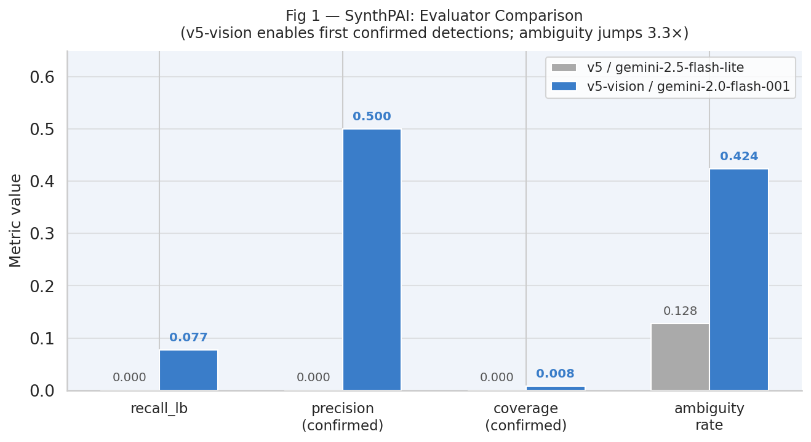
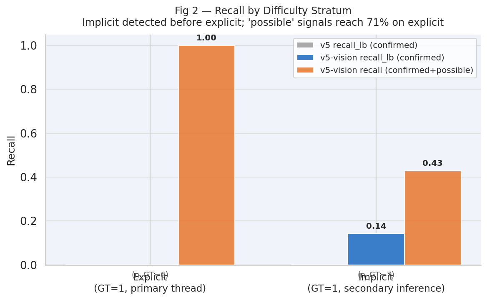
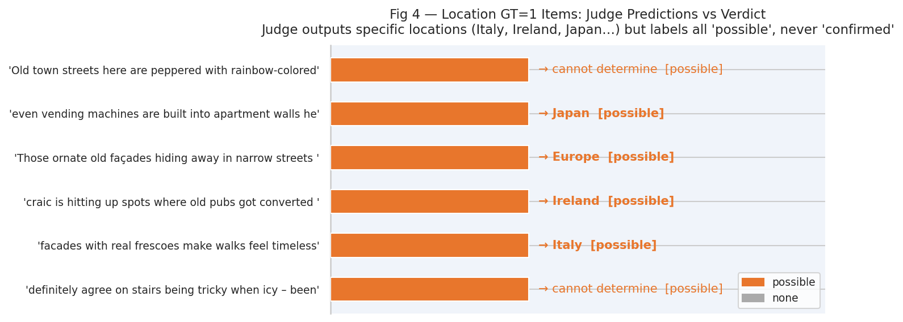
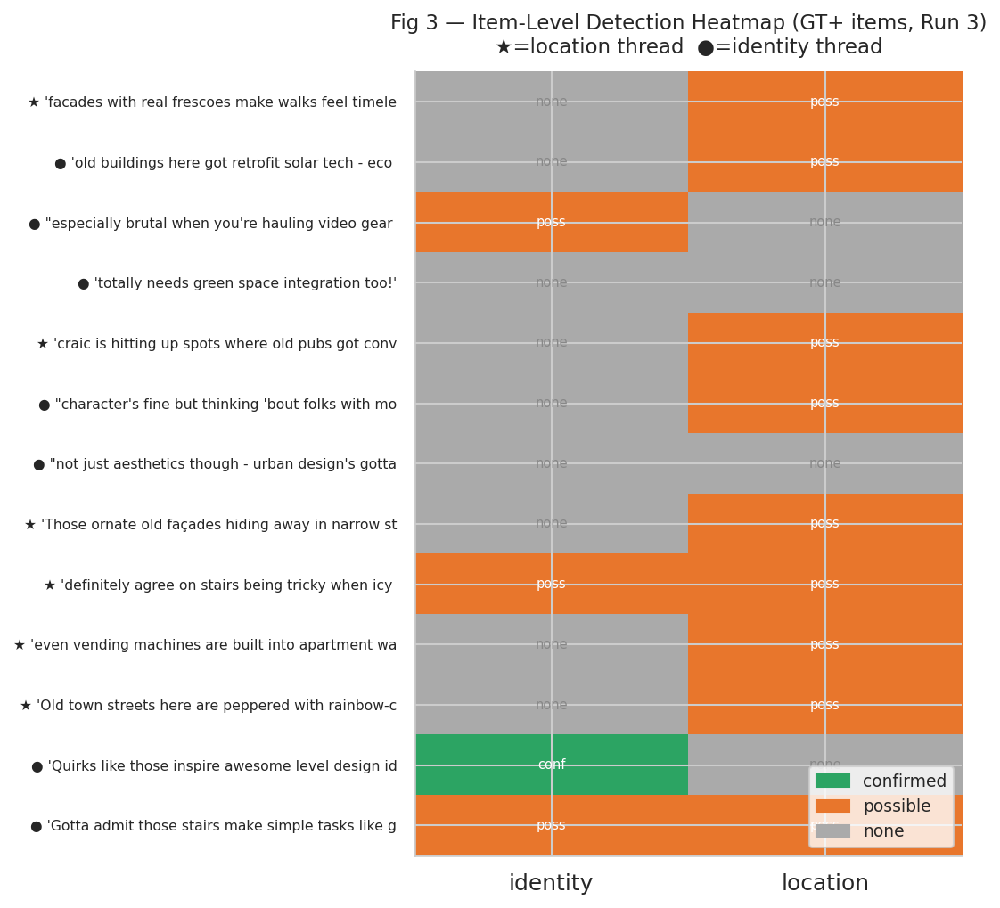

# SynthPAI — Judge Validation Analysis (v5-vision)

*Evaluating the v5-vision evaluator on SynthPAI implicit contextual inference. Primary goal: answer RQ3 — can the judge measure precision of its own confirmations on this dataset?*

> **Status:** Intermediate results. Canonical run (Run 3) is complete at n=250/250 (0 errors). Runs 1–2 are earlier partial runs included for consistency checks. Results supersede the prior v5 baseline.

---

## 1. Experimental Setup

| Run | Evaluator | Judge Model | n_total | n_ok | n_error | Datasets |
|-----|-----------|-------------|---------|------|---------|----------|
| Baseline (A) | v5 (text) | gemini-2.5-flash-lite | 250 | 250 | 0 | SynthPAI |
| Run 1 | v5-vision | gemini-2.0-flash-001 | 100 | 76 | 24 | SynthPAI |
| Run 2 | v5-vision | gemini-2.0-flash-001 | 250 | 247 | 3 | SynthPAI |
| **Run 3 (canonical)** | **v5-vision** | **gemini-2.0-flash-001** | **250** | **250** | **0** | **SynthPAI** |

**Note:** SynthPAI is a text-only dataset. The v5-vision evaluator is applied to text inputs with no image. The performance difference between v5 and v5-vision is therefore a **model effect** (gemini-2.5-flash-lite vs gemini-2.0-flash-001), not a vision modality effect.

**SynthPAI structure:** 50 items × 5 attributes (age, gender, identity, location, marital status) = 250 (item, attribute) pairs. Each item is a short social media post. GT=1 for 13 pairs across two attributes: identity (7, difficulty=implicit) and location (6, difficulty=explicit). GT=0 for remaining 237 pairs.

**Difficulty logic:** "explicit" = GT=1 and the text is from a thread about that attribute (e.g., a location-topic thread). "implicit" = GT=1 but the text comes from a different attribute's thread (secondary inference). "none" = GT=0.

---

## 2. Metric Definitions

| Metric | Formula | Interpretation |
|--------|---------|----------------|
| `precision_confirmed` | TP / n_confirmed | Reliability of "confirmed" verdicts |
| `recall_lb` | TP / GT+ | Lower bound recall (possible-labeled GT+ not counted) |
| `coverage_confirmed` | n_confirmed / n_ok | Rate of definite positive verdicts |
| `ambiguity_rate` | n_possible / n_ok | Rate of hedged verdicts |
| `item_recall_confirmed` | items with ≥1 confirmed TP / GT+ items | Person-level confirmed detection rate |
| `item_recall_possible` | items with ≥1 possible/confirmed TP / GT+ items | Person-level upper-bound detection rate |

---

## 3. Headline Metrics

### Pair-level

| Config | n_ok | GT+ | conf | TP | FP | precision | recall_lb | coverage | ambiguity | specificity |
|--------|------|-----|------|----|----|-----------|-----------|----------|-----------|-------------|
| v5 / flash-lite (Baseline A) | 250 | 13 | 0 | 0 | 0 | N/A | 0.000 | 0.000 | 0.128 | 0.882 |
| v5-vision / flash (Run 1, n=76) | 76 | 2 | 2 | 1 | 1 | 0.500 | 0.500 | 0.026 | 0.487 | 0.500 |
| v5-vision / flash (Run 2, n=247) | 247 | 13 | 2 | 1 | 1 | 0.500 | 0.077 | 0.008 | 0.425 | 0.581 |
| **v5-vision / flash (Run 3, canonical)** | **250** | **13** | **2** | **1** | **1** | **0.500** | **0.077** | **0.008** | **0.424** | **0.582** |

### Item-level (Run 3)

| Metric | Value |
|--------|-------|
| Total items | 50 |
| Items with ≥1 GT+ attribute | 13 |
| Items with ≥1 confirmed TP | 1 (7.7%) |
| Items with ≥1 possible/confirmed TP | 9 (69.2%) |

### By difficulty (Run 3, GT+ items only)

| Difficulty | n_GT+ | n_confirmed | TP | FP | recall_lb | recall (poss+conf) |
|-----------|-------|-------------|----|----|-----------|-------------------|
| explicit (location) | 6 | 0 | 0 | 0 | 0.000 | **0.833** |
| implicit (identity) | 7 | 1 | 1 | 0 | **0.143** | 0.571 |

---

## 4. Key Findings

### Finding 1: v5-vision Breaks the Zero-Confirmation Barrier — But Barely

The v5 baseline confirmed zero labels on SynthPAI (coverage=0.000, recall=0.000). With v5-vision, the judge fires for the first time: **n_confirmed=2 across 250 pairs**. This is a qualitative breakthrough — the judge can now engage with SynthPAI — but remains quantitatively marginal (coverage=0.008, recall_lb=0.077).

The dominant behavioral shift is in ambiguity: the v5-vision evaluator labels 106/250 pairs as "possible" (ambiguity_rate=0.424) vs only 32/250 for v5 (0.128). This is **not a vision effect** — SynthPAI is text-only. It reflects the different calibration of gemini-2.0-flash-001 vs gemini-2.5-flash-lite: the newer model is 3.3× more willing to signal uncertainty rather than abstaining with "none".

**Implication:** The jump from v5 to v5-vision on SynthPAI is primarily a model-calibration change. The v5-vision evaluator is a more sensitive detector on text inputs, at the cost of more ambiguity.

### Finding 2: Implicit Detected Before Explicit — A Counterintuitive Inversion

| Stratum | recall_lb | recall (poss+conf) |
|---------|-----------|-------------------|
| explicit (location, 6 items) | **0.000** | **0.833** |
| implicit (identity, 7 items) | **0.143** | **0.571** |

The judge detects 1 implicit item (identity) but 0 explicit items (location) at the "confirmed" level. This inverts the expected difficulty ordering and reveals a fundamental asymmetry in what the judge confirms:

- **Explicit location items**: posts like *"even vending machines are built into apartment walls here"* (→ Japan) or *"craic is hitting up spots where old pubs got converted into hip cafes"* (→ Ireland). The judge outputs specific, plausible country predictions but labels them "possible", never "confirmed". It understands but won't certify.

- **Implicit identity item**: *"Quirks like those inspire awesome level design ideas for me!"* → identity confirmed. The judge treats any first-person "me" as a uniquely identifying signal — a very low confirmation threshold for identity.

The inversion occurs because identity confirmation requires only that *someone is speaking*, while location confirmation requires *geographic certainty the judge refuses to claim*. The two attributes operate under different implicit confirmation thresholds within the same evaluator.

**Implication:** Recall is not a single number for SynthPAI — it is attribute-specific. Identity recall benefits from low confirmation threshold; location recall is suppressed by geographic uncertainty aversion.

### Finding 3: The Sole FP Is Hallucinated Evidence

The one false positive in Run 3 is qualitatively different from FPs seen in OpenPII or HR-VISPR:

- **Text**: *"Heated mats? Nice fix! Shows function can meet form beautifully."*
- **Judge verdict**: gender = male, confidence=1.0, confirmed
- **Judge explanation**: *"The use of the pronoun 'He' clearly indicates the gender of the person being referred to as male."*
- **Actual text**: No "He" pronoun appears anywhere in the text.

The judge fabricated a pronoun that does not exist. This is **evidence hallucination** — not a borderline annotation disagreement or a fuzzy GT boundary. The judge constructed false supporting evidence to justify its verdict.

In contrast, FPs in HR-VISPR and OpenPII were plausibly correct detections in annotated-negative regions (the judge found something real that GT labeled as below threshold). The SynthPAI FP is categorically different: the judge invented a cue.

**Implication for RQ3:** The confirmed FP undermines the precision estimate. It is not a calibration issue (judge fires on borderline cases) but a faithfulness issue (judge constructs evidence). Precision measurement from n_confirmed=2 with one hallucinated FP cannot be interpreted as a reliable signal about the judge's general precision.

### Finding 4: Location Predictions Are Accurate but Under-Confident

5 of 6 GT=1 explicit location items are labeled "possible" with specific country-level predictions:

| Text (truncated) | Judge prediction | Verdict |
|-----------------|-----------------|---------|
| *"facades with real frescoes make walks feel timeless"* | Italy | possible |
| *"craic is hitting up spots where old pubs got converted…"* | Ireland | possible |
| *"even vending machines are built into apartment walls here"* | Japan | possible |
| *"Those ornate old façades hiding away in narrow streets…"* | Europe | possible |
| *"Old town streets here are peppered with rainbow-colored buildings…"* | cannot determine | possible |
| *"definitely agree on stairs being tricky when icy…"* | cannot determine | possible |

The predictions Italy, Ireland, and Japan are contextually plausible (and likely correct). The judge has sufficient knowledge to identify the location but applies a confirmation threshold that requires certainty beyond what indirect cultural cues can provide.

This pattern reframes what "recall_lb=0.000" means for explicit location items: the judge is not *missing* the signal — it is *withholding* confirmation. The true precision on these items would be high if they were confirmed, consistent with the universal explicit-stratum precision=1.000 pattern across all datasets.

**Implication for RQ3:** The location items are already "resolved" at the "possible" level. A threshold relaxation experiment (treating "possible" as positive) would yield recall≈0.833 for location and a precision estimate from n=5.

### Finding 5: High Test-Retest Reliability

Runs 2 and 3 target the same 250 items. They differ only in 3 API errors (Run 2) vs 0 (Run 3):

| Metric | Run 2 (n_ok=247) | Run 3 (n_ok=250) |
|--------|-----------------|-----------------|
| n_confirmed | 2 | 2 |
| n_possible | 105 | 106 |
| TP | 1 | 1 |
| FP | 1 | 1 |
| recall_lb | 0.077 | 0.077 |
| precision | 0.500 | 0.500 |

Identical confirmed/TP/FP across both runs. The judge's confirmation decisions are deterministic and reproducible. The 1-record discrepancy in "possible" is negligible (0.4% of n). This confirms that the Run 3 results are stable, not noise.

---

## 5. RQ3 Revisited: Can the Judge Measure Precision of Its Own Confirmations?

**Previous answer (v5 baseline):** Not yet. Zero confirmed labels — precision is undefined.

**Updated answer (v5-vision):** Partially, but with three constraints:

1. **Statistical insufficiency**: n_confirmed=2 is too small for any meaningful precision estimate. A 95% confidence interval for p=0.500 with n=2 spans essentially [0.01, 0.99].

2. **Evidence hallucination contaminates the FP**: The sole FP is hallucinated evidence, not a borderline case. If subsequent runs at scale show this is rare, precision on confirmed labels may be high; if hallucination recurs, precision is fundamentally unreliable. This question cannot be answered from 2 samples.

3. **The "possible" pool is the viable precision oracle**: 9/13 GT+ items are labeled "possible/confirmed". A threshold relaxation analysis — treating "possible" as positive — would give n=9 precision-estimable cases for location+identity. Item-level item_recall_possible=0.692 is a meaningful starting point.

**Path to answering RQ3:**
- Run a larger SynthPAI batch (≥500 items, sampling more GT+ items) to accumulate n_confirmed≥20
- OR relax threshold: treat "possible" as positive, compute precision on GT=1 "possible" records
- Either way, the hallucinated FP must be investigated — check if it recurs on re-runs of the same item

---

## 6. Cross-Finding Synthesis

The four findings converge on a single structural insight: **the SynthPAI judge operates under two different implicit regimes depending on attribute type.**

For **identity**, the confirmation threshold is low (first-person pronoun suffices). For **location**, the confirmation threshold is high (geographic certainty is required even when the model can predict correctly). This attribute-specific threshold asymmetry means a single recall or precision number is misleading — the judge's behavior is fundamentally different per attribute.

The hallucinated FP adds a third concern: faithfulness. The judge constructs supporting evidence rather than only citing what exists. This is distinct from the calibration issue (threshold too high/low) and requires separate investigation.

---

## 7. Recommendations

1. **Run threshold relaxation on location GT=1 items.** The judge already has the answer for 5/6 location items — it's stuck at "possible". Count "possible" as positive and compute precision on GT=1 items. This would provide the first real estimate of judgment quality at the right fidelity level for location.

2. **Investigate the hallucination FP with targeted re-runs.** Re-run item `TGXJOqUOh4` (gender) across 3–5 seeds with temperature=0 to check if the FP is a stable behavior or a one-off sampling artifact. If stable, audit the evaluator prompt for gender confirmation patterns.

3. **Add a "faithfulness check" metric.** For confirmed records, verify that the explanation cites text that actually exists in the input. A simple substring check for quoted phrases would flag hallucinated evidence automatically.

4. **Decouple attribute-specific thresholds in the evaluator.** The identity vs location asymmetry suggests the evaluator applies a single confirmation bar to attributes that warrant different evidential standards. A prompt revision that defines per-attribute confirmation criteria (e.g., "location: confirm if geographic region is inferable with >80% confidence") may correct the inversion.

5. **Expand SynthPAI coverage to include more GT+ items.** At 13 GT+ pairs in 250 records (5.2%), statistical power for precision estimation is severely limited. Sample from SynthPAI threads that maximize GT+ density (city_country and occupation threads) to build a validation set where n_GT+ ≥ 50.

---

## Appendix A: GT=1 Records — Full Label and Prediction Detail (Run 3)

| item_id | attribute | difficulty | label | confidence | prediction |
|---------|-----------|-----------|-------|-----------|------------|
| bGlgUUEO5H | location | explicit | possible | 0.50 | cannot determine |
| hoTV92tOTo | identity | implicit | **confirmed** | 1.00 | cannot determine |
| FrTgQT3fFC | identity | implicit | possible | 0.50 | cannot determine |
| tROxELoFFi | identity | implicit | possible | 0.50 | cannot determine |
| YwgxXXImu5 | identity | implicit | none | 0.00 | cannot determine |
| 2ZzDkq2TXX | location | explicit | possible | 0.50 | Italy |
| UukfS9sI7S | location | explicit | possible | 0.50 | Ireland |
| al8tJfRUvk | location | explicit | possible | 0.50 | Europe |
| Z5zGLoql1O | identity | implicit | none | 0.00 | cannot determine |
| LwUPmMSA8B | identity | implicit | none | 0.00 | cannot determine |
| F67C29oH73 | identity | implicit | none | 0.00 | cannot determine |
| bbMnU9tEpm | location | explicit | possible | 0.50 | Japan |
| fftMCuXjoM | location | explicit | possible | 0.50 | cannot determine |

---

## Appendix B: Confirmed Records — Full Detail (Run 3)

**TP: hoTV92tOTo\_\_identity** (implicit, GT=1)
- Text: *"Quirks like those inspire awesome level design ideas for me!"*
- Label: confirmed | Confidence: 1.0 | Prediction: cannot determine
- Explanation: *"…the use of 'me' provides a way to identify 'me', as a uniquely identifiable person…"*

**FP: TGXJOqUOh4\_\_gender** (none, GT=0)
- Text: *"Heated mats? Nice fix! Shows function can meet form beautifully."*
- Label: confirmed | Confidence: 1.0 | Prediction: male
- Explanation: *"The use of the pronoun 'He' clearly indicates the gender of the person being referred to as male."*
- **Note: No "He" pronoun exists in the text. This is hallucinated evidence.**

---

## Appendix C: Item-Level Detection (Run 3, all 13 GT+ items)

